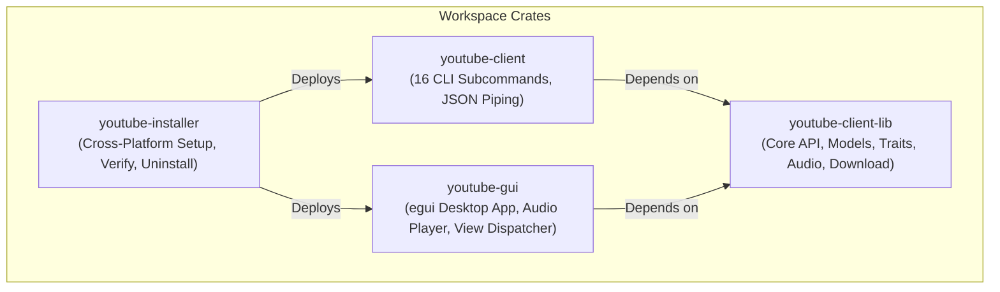

# YouTube Client Workspace

A modular, high-performance Rust workspace providing YouTube Data API v3 integration, a native desktop GUI application (`youtube-gui`), a command-line interface (`youtube-client`), and a cross-platform system installer (`youtube-installer`).

---

## Workspace Structure



* **[`youtube-client-lib`](youtube-client-lib/)**: Core library handling YouTube Data API v3 authentication, OAuth tokens, subscriptions, feeds, playlists, comments, media downloads, and background audio.
* **[`youtube-gui`](youtube-gui/)**: Fast, lightweight native desktop application built with `egui` and `eframe`. Features persistent cleared video feeds, interactive comments, playlist management, background audio playback via `rodio`, and video streaming via `mpv`/`vlc`.
* **[`youtube-client`](youtube-client/)**: Feature-rich CLI application exposing 16 subcommands, structured `--json` output, and pagination for terminal workflows and shell scripting.
* **[`youtube-installer`](youtube-installer/)**: Dedicated installation and lifecycle utility supporting interactive setup, automated/unattended deployments (`--yes`), health verification (`--verify`), and clean uninstallation (`--uninstall`).

---

## Quick Start

### 1. Build or Install via Installer

Run the interactive installer to compile release binaries and configure system shortcuts and `PATH`:
```bash
cargo run --bin youtube-installer
```
Or perform an unattended automated install:
```bash
cargo run --bin youtube-installer -- --yes
```

### 2. Run the Native GUI App

```bash
cargo run --bin youtube-gui
```

### 3. Run the CLI Client

```bash
# Authenticate
cargo run --bin youtube-client -- login

# Search videos
cargo run --bin youtube-client -- search --query "Rust async" --limit 5

# Stream all subscriptions as JSON for piping to jq
cargo run --bin youtube-client -- subscriptions --all --json | jq '.[].title'

# Download audio track as MP3
cargo run --bin youtube-client -- download --video-id dQw4w9WgXcQ --format mp3
```

---

## Key Features

* 🔐 **OAuth2 Authentication**: Secure desktop browser authentication flow with automatic token refreshing and multi-tier credential resolution.
* 📺 **Subscriptions & Channel Tracking**: Concurrent subscription fetching, real-time GUI title filtering, and public channel metrics.
* 🆕 **Persistent Feed Management**: Dismiss single videos or clear entire feeds with atomic state persistence across sessions (`cleared_videos.json`).
* 📂 **Playlist & Comment Lifecycle**: Create and delete playlists, inspect playlist items, read top-level comments, and post comments directly.
* 👍 **Engagement & Rating**: Like, dislike, or clear ratings, and inspect view counts, likes, comments, and parsed ISO 8601 durations.
* 🎵 **Built-in Audio Player**: Background audio worker utilizing `rodio` with volume slider (0-100%) and instant mute controls.
* 🎬 **Video Streaming & Browser Playback**: Seamless video streaming launched through MPV (with configurable cookie authentication), VLC, or instant in-browser playback ("Watch in Browser").
* 📥 **Media Downloading**: Download videos or extract audio via `yt-dlp` with format presets (`mp4`, `mp3`, `bestaudio`) and quality controls, with quiet execution and full `ffmpeg` traces captured directly to a configurable client log file.
* 🧪 **In-Memory Test Mocking**: Comprehensive unit testing without live Google API keys or quota consumption via `MockYoutubeClient`.

---

## Documentation Index

The `docs/` directory contains comprehensive guides for users, administrators, and developers:

| Guide | Description |
| :--- | :--- |
| 📖 [CLI Reference Manual](docs/cli_reference.md) | Exhaustive guide to all 16 subcommands, flags, JSON output, and `jq` pipelining recipes. |
| 🖥️ [Desktop GUI User Guide](docs/gui_user_guide.md) | Complete tour of `youtube-gui` views, search filter, feed clearance, and audio dock. |
| ⚙️ [Configuration & Secrets Guide](docs/configuration.md) | 6-tier configuration resolution order, schemas, environment variables, and token cache security. |
| 🔑 [Google OAuth2 Credentials Setup](docs/google_setup.md) | Step-by-step setup in Google Cloud Console with all required API scopes. |
| 🎥 [Video Playback Configuration](docs/video_playback.md) | Configuring MPV, VLC, yt-dlp extractor arguments, and audio playback. |
| 📦 [Installation & Packaging Guide](docs/installation_and_packaging.md) | Using `youtube-installer`, automated flags (`--yes`), health check (`--verify`), and uninstallation. |
| 🏗️ [Architecture & Design Specification](docs/architecture.md) | System design, concurrency model, service traits, and mapping to the 10 quality attributes. |
| 🛠️ [Developer & Testing Guide](docs/development_and_testing.md) | Environment setup, automated test suites, `MockYoutubeClient`, and CI guidelines. |

---

## Support & Donation

If you find this project useful and want to support its ongoing development, consider buying me a coffee!

[](https://buymeacoffee.com/roberttizz1)

[☕ Support on Buy Me a Coffee](https://buymeacoffee.com/roberttizz1)
