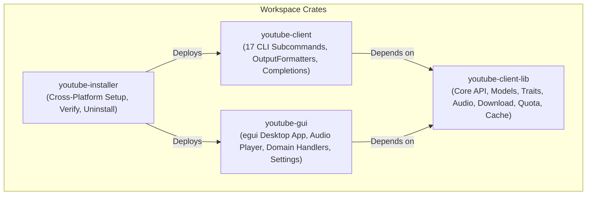

# YouTube Client Workspace (v0.2.0)

[](https://github.com/clockworkengineer/youtube-client/actions/workflows/ci.yml)
[](Cargo.toml)
[](LICENSE)
[](docs/development_and_testing.md)

A modular, high-performance Rust workspace engineered under **SOLID Clean Architecture** principles, providing YouTube Data API v3 integration, a native desktop GUI application (`youtube-gui`), a command-line interface (`youtube-client`), and a cross-platform system installer (`youtube-installer`).

---

## Workspace Structure


```mermaid
graph TD
    subgraph "Workspace Crates"
        LIB["youtube-client-lib<br/>(Core API, Models, Traits, Audio, Download, Quota, Cache)"]
        CLI["youtube-client<br/>(17 CLI Subcommands, OutputFormatters, Completions)"]
        GUI["youtube-gui<br/>(egui Desktop App, Audio Player, Domain Handlers, Settings)"]
        INST["youtube-installer<br/>(Cross-Platform Setup, Verify, Uninstall)"]
    end

    CLI -->|Depends on| LIB
    GUI -->|Depends on| LIB
    INST -->|Deploys| CLI
    INST -->|Deploys| GUI
```

* **[`youtube-client-lib`](youtube-client-lib/)**: Core library handling YouTube Data API v3 authentication, OAuth tokens, subscriptions, feeds, playlists, comments, media downloads, background audio decoding, API quota budget tracking, and pluggable player/importer registries.
* **[`youtube-gui`](youtube-gui/)**: Fast, lightweight native desktop application built with `egui` and `eframe`. Features persistent watch progress & resume controls, Return YouTube Dislike (RYD) metrics, in-app Settings view, interactive timeline audio scrubber, and decoupled domain event handlers.
* **[`youtube-client`](youtube-client/)**: Feature-rich CLI application exposing 17 subcommands, pluggable output formatters (`TableFormatter`, `JsonFormatter`, `CsvFormatter`), shell auto-completions, and structured piping for terminal workflows and shell scripting.
* **[`youtube-installer`](youtube-installer/)**: Dedicated installation and lifecycle utility supporting standalone pre-built distributions, automated deployments (`--yes`), Windows Add/Remove Programs integration, health verification (`--verify`), and clean uninstallation (`--uninstall`).

---

## SOLID Clean Architecture Highlights

The workspace is refactored across 5 distinct SOLID phases:
1. **Dependency Inversion & Liskov Substitution (DIP & LSP):** Core services implement segregated traits (`VideoService`, `SubscriptionService`, `PlaylistService`, `CommentService`). The composite `YoutubeApiService` and `YoutubeBackend` adapter support seamless switching between live network execution and in-memory `MockYoutubeClient` for offline testing.
2. **Pluggable Media Players (OCP):** External media players implement the `MediaPlayer` trait (`MpvPlayer`, `VlcPlayer`, `IinaPlayer`, `CustomExecutablePlayer`, `SystemDefaultPlayer`) orchestrated by a prioritized `PlayerRegistry`.
3. **Multi-Format Subscription Importers (OCP & Strategy Pattern):** Standardized `SubscriptionFormat` strategies support importing and exporting subscriptions across OPML, Google Takeout CSV (`subscriptions.csv`), and NewPipe JSON.
4. **Decoupled GUI Domain Handlers (SRP & ISP):** Monolithic GUI dispatching is partitioned into dedicated domain handlers (`auth`, `navigation`, `playback`, `download`, `settings`, `library`) with a unified `VideoDetailsContext`.
5. **Decoupled CLI Output Formatters (SRP & OCP):** Terminal presentation is separated from API querying via the `OutputFormatter<T>` trait, providing formatted tables, pretty JSON, and RFC-4180 CSV outputs.

See [SOLID Architecture Specification](docs/solid_architecture.md) for complete details.

---

## Quick Start

### 1. Build or Install via Installer

Run the interactive installer to compile release binaries and configure system shortcuts and `PATH`:
```bash
cargo run --bin youtube-installer
```
Or perform an unattended automated install:
```bash
cargo run --bin youtube-installer -- --yes
```
Alternatively, on Windows, download and execute the standalone installer `youtube-client-setup-0.2.0.exe` built via Inno Setup.

### 2. Run the Native GUI App

```bash
cargo run --bin youtube-gui
```

### 3. Run the CLI Client

```bash
# Authenticate
cargo run --bin youtube-client -- login

# Search videos
cargo run --bin youtube-client -- search --query "Rust async" --limit 5

# Stream all subscriptions as JSON for piping to jq
cargo run --bin youtube-client -- subscriptions --all --json | jq '.[].title'

# Download audio track as MP3
cargo run --bin youtube-client -- download --video-id dQw4w9WgXcQ --format mp3
```

---

## Key Features

* 🔐 **OAuth2 Authentication & Centralized Storage**: Secure browser-based authentication flow storing tokens with OS security permissions in `%APPDATA%/youtube-client` (Windows) or `~/.config/youtube-client` (Linux/macOS).
* ⚙️ **Native In-App Settings**: Graphical settings view in `youtube-gui` allowing player configuration (Auto, MPV, VLC, Custom), download directory selection, browser cookie extraction (`chrome`, `firefox`, `edge`, `brave`), and one-click account disconnection.
* 👍 **Return YouTube Dislike (RYD) Integration**: Non-blocking public API lookup displaying restored community dislike counts and ratios across CLI details and GUI cards.
* 🎵 **Interactive Audio Scrubber & Dock**: Background audio player with timeline scrubber slider, 10s instant skip buttons (`⏪ 10s`, `⏩ 10s`), duration readout (`MM:SS / MM:SS`), and volume controls.
* ⏱️ **Watch Progress Tracking & Resume Playback**: Watches timestamps per video ID (`playback_positions.json`), displaying watched badges (`⏱ Watched to MM:SS`) and offering instant `▶ Resume` controls.
* 📊 **API Quota Budget Tracking**: Accurately accounts for YouTube Data API v3 unit costs (search: 100u, reads: 1u, writes: 50u) with daily UTC rollover and real-time visual gauge in Settings.
* 🌐 **Zero-Quota Public RSS Fallback**: Automatically falls back to YouTube public Atom XML feeds when browsing channel uploads without requiring API keys or quota consumption.
* ⚡ **In-Memory TTL Metadata Cache**: Configurable time-to-live caching for video metadata (30m) and channel profiles (2h), eliminating redundant API requests.
* 📥 **Media Downloading**: Download videos or audio via `yt-dlp` with format presets (`mp4`, `mp3`, `bestaudio`), real-time percentage progress bars, and diagnostics logging.
* 🧪 **In-Memory Test Mocking**: 67 unit and integration tests executing with 0 live API credentials using `MockYoutubeClient`.

---

## Documentation Index

The `docs/` directory contains comprehensive specifications and guides:

| Guide | Description |
| :--- | :--- |
| 📖 [CLI Reference Manual](docs/cli_reference.md) | Exhaustive guide to all 17 subcommands, flags, OutputFormatters, JSON output, and `jq` pipelining. |
| 🖥️ [Desktop GUI User Guide](docs/gui_user_guide.md) | Tour of `youtube-gui` views, Settings panel, audio scrubber, resume playback, and download progress. |
| ⚙️ [Configuration & Secrets Guide](docs/configuration.md) | 6-tier configuration hierarchy, JSON schema, window geometry, and persistent state files. |
| 🔑 [Google OAuth2 Credentials Setup](docs/google_setup.md) | Step-by-step setup in Google Cloud Console with all required API scopes. |
| 🎥 [Video Playback Configuration](docs/video_playback.md) | Configuring MPV, VLC, IINA, custom players, start offsets, and Rodio audio playback. |
| 📦 [Installation & Packaging Guide](docs/installation_and_packaging.md) | Using `youtube-installer`, Inno Setup Windows installer, and GitHub Actions release workflows. |
| 🏗️ [Architecture & Design Specification](docs/architecture.md) | Workspace design, component topology, concurrency model, and 10 quality attributes. |
| 🏛️ [SOLID Architecture Specification](docs/solid_architecture.md) | In-depth breakdown of the 5 SOLID refactoring phases, design patterns, and extension recipes. |
| 📊 [Caching & API Quota Guide](docs/caching_and_quota.md) | YouTube API quota economics, `QuotaTracker`, TTL cache, and public RSS Atom feed fallback. |
| 🛠️ [Developer & Testing Guide](docs/development_and_testing.md) | Environment setup, 67 test suites, `MockYoutubeClient`, Clippy standards, and CI pipelines. |

---

## Support & Donation

If you find this project useful and want to support its ongoing development, consider buying me a coffee!

[](https://buymeacoffee.com/roberttizz1)

[☕ Support on Buy Me a Coffee](https://buymeacoffee.com/roberttizz1)
