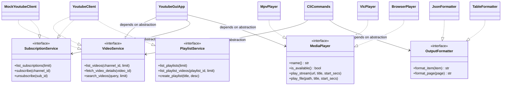
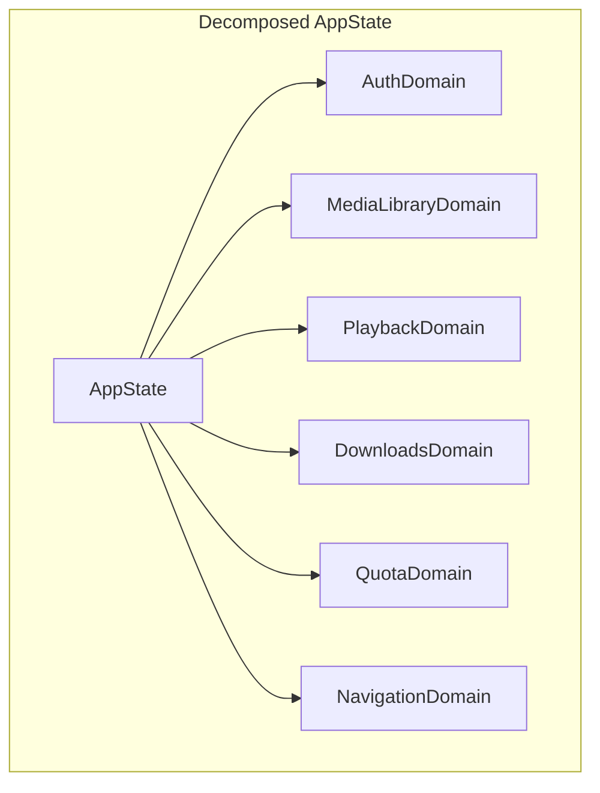

# Architectural Analysis & Concrete SOLID Refactoring Plan
**Target Workspace:** `youtube-client` (`youtube-client-lib`, `youtube-gui`, `youtube-client`, `youtube-installer`)  
**Document Version:** 1.0.0  
**Date:** October 2026  
**Status:** Approved for Phased Execution  

---

## Executive Summary

An architectural audit of the `youtube-client` workspace was conducted against the five foundational **SOLID** object-oriented and systems design principles:
- **S** — Single Responsibility Principle (SRP)
- **O** — Open/Closed Principle (OCP)
- **L** — Liskov Substitution Principle (LSP)
- **I** — Interface Segregation Principle (ISP)
- **D** — Dependency Inversion Principle (DIP)

While `youtube-client-lib` has made significant progress by establishing service traits (`VideoService`, `SubscriptionService`, `PlaylistService`, `CommentService`, `MediaDownloader`) and an in-memory `MockYoutubeClient`, **the application consumers (`youtube-gui` and `youtube-client` CLI) remain tightly coupled to concrete structs**. Furthermore, `youtube-gui` exhibits classic "God Object" anti-patterns in [`AppState`](file:///c:/Projects/youtube-client/youtube-gui/src/types.rs) and massive monolithic event dispatchers in [`main.rs`](file:///c:/Projects/youtube-client/youtube-gui/src/main.rs).

This document details:
1. A forensic analysis of current SOLID violations across all 4 workspace crates.
2. A future-state Clean Architecture model.
3. A 5-phase concrete refactoring roadmap designed for zero-downtime, non-breaking incremental delivery.

---

## SOLID Compliance Scorecard

| Crate | SRP (Single Responsibility) | OCP (Open/Closed) | LSP (Liskov Substitution) | ISP (Interface Segregation) | DIP (Dependency Inversion) | Overall Grade |
| :--- | :---: | :---: | :---: | :---: | :---: | :---: |
| **`youtube-client-lib`** | **B+** (Clean models, but player & format matching) | **B-** (Match on player & importer types) | **A** (`MockYoutubeClient` is fully substitutable) | **A** (Segregated service traits) | **B+** (Client uses builders, but lacks media player trait) | **A-** |
| **`youtube-client` (CLI)** | **C** (Commands mix fetch & ASCII/JSON rendering) | **C** (Match on commands; hardcoded formats) | **D** (Cannot substitute mock client in CLI) | **B** (Commands take full context) | **F** (Directly calls `YoutubeClientBuilder`) | **C-** |
| **`youtube-gui`** | **D** (God Object `AppState`, 1100-line `main.rs`) | **C-** (400-line `match PendingAction`) | **F** (Cannot run GUI with Mock/Alternate backend) | **D** (Views take 12 loose parameters or full state) | **F** (Hardcoded `YoutubeClient` in `get_client_async`) | **D+** |
| **`youtube-installer`** | **A** (Clean separation of platform & prompt) | **B+** (Platform matches `cfg(target_os)`) | **A** (Clean platform independence) | **A** (Focused helper modules) | **B** (Direct std/winreg calls) | **A-** |

---

## Part 1: Forensic Source Analysis of SOLID Violations

### 1. Single Responsibility Principle (SRP)
> *"A module should have one, and only one, reason to change."*

#### Violations Identified:
1. **The `AppState` "God Object" ([`youtube-gui/src/types.rs:84-105`](file:///c:/Projects/youtube-client/youtube-gui/src/types.rs#L84-L105))**:
   - `AppState` aggregates **20 distinct responsibilities**: authentication status, UI view routing history, in-memory thumbnail cache & LRU queue, active download statuses, Rodio audio player state, playlist management, downloads directory, log file paths, cleared video hashes, persistent playback positions, quota tracker, and toast notifications.
   - Any change to audio playback, UI navigation, or background downloading forces a mutation of the same monolithic `Arc<Mutex<AppState>>`, creating lock contention and cross-domain fragility.
2. **Monolithic UI Event Loop & Action Dispatcher ([`youtube-gui/src/main.rs:600-985`](file:///c:/Projects/youtube-client/youtube-gui/src/main.rs#L600-L985))**:
   - `YoutubeGuiApp::update` contains a single massive `match action` statement spanning nearly 400 lines that handles everything from spawning subprocesses, creating directories, parsing OPML files, manipulating window geometry, to firing audio commands.
3. **CLI Commands Blending Coordination with Presentation ([`youtube-client/src/commands/*.rs`](file:///c:/Projects/youtube-client/youtube-client/src/commands))**:
   - For example, in [`commands/videos.rs`](file:///c:/Projects/youtube-client/youtube-client/src/commands/videos.rs#L10-L40), the function `execute_videos` is simultaneously responsible for:
     - Authenticating the client
     - Performing the remote API call
     - Implementing JSON serialization
     - Computing column widths and formatting ASCII terminal tables.
   - A formatting change requires modifying the command execution logic.
4. **Parameter Explosion in View Functions ([`youtube-gui/src/views/details_view.rs:10-22`](file:///c:/Projects/youtube-client/youtube-gui/src/views/details_view.rs#L10-L22))**:
   - `render_video_details` accepts **12 loose parameters** (`state`, `http_client`, `audio_tx`, `ui`, `ctx`, `video`, `details`, `comments`, `player_state`, `playlists`, `playlist_action_status`, `comment_input`). It coordinates playback, download progress, dislike lookups, comment posts, and playlist modals.

---

### 2. Open/Closed Principle (OCP)
> *"Software entities should be open for extension, but closed for modification."*

```mermaid
graph TD
    subgraph Current Violation (Hardcoded Matches)
        A[launch_external_player] -->|match| B[mpv]
        A -->|match| C[vlc]
        A -->|fallback| D[Default Browser]
    end
    subgraph Target OCP Architecture
        E[MediaPlayer Trait] <|-- F[MpvPlayer]
        E <|-- G[VlcPlayer]
        E <|-- H[IinaPlayer / Celluloid]
        E <|-- I[CustomExecutablePlayer]
        J[PlayerRegistry] --> E
    end
```

#### Violations Identified:
1. **Hardcoded Media Player Launching ([`youtube-client-lib/src/utils.rs:320-375`](file:///c:/Projects/youtube-client/youtube-client-lib/src/utils.rs#L320-L375))**:
   - `launch_external_player_with_options` inspects player paths via string matching (`"mpv"`, `"vlc"`). Adding support for new players (e.g., `iina`, `celluloid`, `mpvnet`, `ffplay`) requires modifying the core function rather than registering a new implementation of a `MediaPlayer` trait.
2. **Fixed Subscription Format Parsers ([`youtube-client-lib/src/importers.rs`](file:///c:/Projects/youtube-client/youtube-client-lib/src/importers.rs))**:
   - Importers exist as top-level standalone functions (`import_subscriptions_from_opml`, `import_subscriptions_from_takeout_csv`, `import_subscriptions_from_newpipe_json`). Adding a format (e.g. Invidious JSON, FreeTube SQLite, generic RSS) requires editing `main.rs` and `importers.rs` rather than registering a `SubscriptionFormatStrategy`.
3. **Monolithic Action Enum ([`youtube-gui/src/types.rs:PendingAction`](file:///c:/Projects/youtube-client/youtube-gui/src/types.rs#L159-L265))**:
   - Adding any new user interaction requires modifying `types.rs`, updating `main.rs`'s 400-line match arm, and updating the triggering view.

---

### 3. Liskov Substitution Principle (LSP)
> *"Objects of a superclass should be replaceable with objects of its subclasses without breaking application correctness."*

#### Violations Identified:
1. **Complete Inability to Substitute Client Implementations in GUI and CLI**:
   - `youtube-client-lib` provides [`MockYoutubeClient`](file:///c:/Projects/youtube-client/youtube-client-lib/src/testing/mock.rs), which implements all 5 service traits.
   - However, in `youtube-gui/src/actions.rs`:
     ```rust
     pub async fn get_client_async() -> Result<YoutubeClient, String> // Concrete!
     ```
   - Neither `MockYoutubeClient` nor an offline/RSS/Invidious backend can be substituted into `youtube-gui` or `youtube-client` CLI without compiler errors.
   - Tests in `youtube-gui` cannot run in headless offline CI environments because the GUI cannot substitute an in-memory client.

---

### 4. Interface Segregation Principle (ISP)
> *"Clients should not be forced to depend upon interfaces that they do not use."*

#### Violations Identified:
1. **Views Forced to Depend on Global State**:
   - Views like [`render_about_view`](file:///c:/Projects/youtube-client/youtube-gui/src/views.rs) or [`render_settings_view`](file:///c:/Projects/youtube-client/youtube-gui/src/views/settings_view.rs) accept `&AppState`, exposing all download lists, auth tokens, thumbnails, and playback positions when all they require is `quota_tracker` and directory paths.
2. **Audio Dock Coupled to `AppState`**:
   - The Rodio audio worker thread in [`youtube-gui/src/player.rs`](file:///c:/Projects/youtube-client/youtube-gui/src/player.rs#L85-L160) holds an `Arc<Mutex<AppState>>` solely to update 2 float fields (`position_secs`, `duration_secs`) and flush playback positions, locking out the entire UI thread every 200ms.

---

### 5. Dependency Inversion Principle (DIP)
> *"High-level modules should not depend on low-level modules. Both should depend on abstractions. Abstractions should not depend on details. Details should depend on abstractions."*

#### Violations Identified:
1. **High-Level UI Commands Depend Directly on Concrete Google API Client**:
   - High-level orchestration in `youtube-gui/src/actions.rs` directly constructs low-level `google_youtube3::YouTube` wrappers through `YoutubeClient`.
   - High-level modules should depend on `dyn VideoService`, `dyn SubscriptionService`, etc.
2. **Subcommands Depend on Concrete `CliContext` Constructing Concrete Client**:
   - `CliContext::get_client(&self)` returns `anyhow::Result<YoutubeClient>`. It should return `Arc<dyn FullYoutubeService>` or generic service traits.

---

## Part 2: Target Clean Architecture



---

## Part 3: Phased Refactoring Roadmap

### Phase 1: Dependency Inversion in GUI & CLI Clients
**Primary Goal**: Decouple `youtube-gui` and `youtube-client` from concrete `YoutubeClient`, enabling 100% testable, interchangeable backends.

1. **Composite Service Trait (`youtube-client-lib/src/traits/mod.rs`)**:
   ```rust
   pub trait YoutubeApiService:
       VideoService + SubscriptionService + PlaylistService + CommentService + Send + Sync
   {}
   impl<T> YoutubeApiService for T where
       T: VideoService + SubscriptionService + PlaylistService + CommentService + Send + Sync
   {}
   ```
2. **Refactor GUI `actions.rs`**:
   - Introduce `ClientProvider`:
     ```rust
     pub type DynYoutubeService = Arc<dyn YoutubeApiService>;

     pub trait ServiceProvider: Send + Sync {
         fn get_service(&self) -> Result<DynYoutubeService, String>;
     }
     ```
   - Update `spawn_client_action` to pass `DynYoutubeService` instead of concrete `YoutubeClient`.
3. **Refactor CLI `CliContext`**:
   - Change `pub async fn get_client(&self) -> anyhow::Result<Arc<dyn YoutubeApiService>>`.
   - Subcommands accept `&dyn VideoService`, `&dyn SubscriptionService`, etc.

---

### Phase 2: Pluggable Media Players & Downloaders (Open/Closed Principle)
**Primary Goal**: Eliminate hardcoded string matching on `"mpv"` and `"vlc"`, allowing any external player or downloader to be added via trait implementation.

1. **Define `MediaPlayer` Trait (`youtube-client-lib/src/player.rs`)**:
   ```rust
   pub struct PlayOptions {
       pub start_secs: Option<f32>,
       pub cookies_file: Option<PathBuf>,
       pub user_agent: Option<String>,
       pub log_file: Option<PathBuf>,
   }

   pub trait MediaPlayer: Send + Sync {
       fn id(&self) -> &'static str;
       fn display_name(&self) -> &'static str;
       fn is_available(&self) -> bool;
       fn launch_stream(&self, url: &str, title: &str, opts: &PlayOptions) -> Result<std::process::Child, String>;
       fn launch_file(&self, path: &Path, title: &str, opts: &PlayOptions) -> Result<std::process::Child, String>;
   }
   ```
2. **Implementations**:
   - `MpvPlayer`: encapsulates `--start`, `--title`, `--save-position-on-quit`.
   - `VlcPlayer`: encapsulates `--start-time`, `--meta-title`.
   - `BrowserPlayer`: fallback via `open::that`.
   - `CustomExecutablePlayer`: user-specified custom binary path.
3. **`PlayerRegistry`**:
   - Auto-detects available players in system `PATH` and selects the best default without ad-hoc `if/else` logic.

---

### Phase 3: Pluggable Subscription & Playlist Importers (Strategy Pattern)
**Primary Goal**: Replace top-level functions with an extensible format strategy.

1. **Define `SubscriptionFormat` Trait (`youtube-client-lib/src/importers/mod.rs`)**:
   ```rust
   pub trait SubscriptionFormat: Send + Sync {
       fn name(&self) -> &'static str;
       fn default_extension(&self) -> &'static str;
       fn can_parse(&self, content: &str, path: Option<&Path>) -> bool;
       fn parse(&self, content: &str) -> Result<Vec<SubscriptionImport>, String>;
       fn serialize(&self, subs: &[SubscriptionImport]) -> Result<String, String>;
   }
   ```
2. **Strategies**:
   - `OpmlSubscriptionFormat`
   - `TakeoutCsvSubscriptionFormat`
   - `NewPipeJsonSubscriptionFormat`
3. **Universal Importer Registry**:
   - `SubscriptionImporter::import_auto_detect(content, path)` iterates registered formats and parses using the first format where `can_parse(...) == true`.

---

### Phase 4: Decomposition of GUI God Object & Action Handlers (Single Responsibility)
**Primary Goal**: Decompose `AppState` into cohesive sub-domains and decouple `PendingAction` dispatching.



1. **Sub-Domain Structs**:
   - `AuthDomain`: `token_cache_path`, `credentials`, `login_state`.
   - `MediaLibraryDomain`: `subscriptions`, `new_videos`, `playlists`, `cleared_ids`.
   - `PlaybackDomain`: `positions`, `player_state`, `preferred_player`.
   - `DownloadsDomain`: `downloads`, `downloads_dir`, `active_tasks`.
   - `QuotaDomain`: `quota_tracker`, `quota_path`.
   - `NavigationDomain`: `current_view`, `view_history`, `toast`.
2. **Action Handler Pattern**:
   - Replace the 400-line `match` in `main.rs` with dedicated domain handlers:
     - `AuthActionHandler`
     - `NavigationActionHandler`
     - `PlaybackActionHandler`
     - `DownloadActionHandler`
     - `SettingsActionHandler`
3. **View Contexts**:
   - `VideoDetailsViewContext`: replaces the 12 loose function parameters of `render_video_details` with a single cohesive context referencing only the needed sub-domains.

---

### Phase 5: CLI Output Formatting & Command Handler Decoupling
**Primary Goal**: Separate data fetching from terminal output formatting across all CLI subcommands.

1. **`OutputFormatter` Trait (`youtube-client/src/formatters.rs`)**:
   ```rust
   pub trait OutputFormatter<T> {
       fn render(&self, item: &T) -> String;
       fn render_page(&self, page: &Page<T>) -> String;
   }
   ```
2. **Implementations**:
   - `TableFormatter<T>`: handles column width calculation, header styling, and truncation.
   - `JsonFormatter<T>`: handles pretty-printing and streaming JSON lines for piping to `jq`.
   - `CsvFormatter<T>`: outputs clean CSV for spreadsheet ingest.
3. **Subcommand Simplification**:
   - Subcommands focus purely on parsing flags, calling the service trait, and handing the result to the selected `OutputFormatter`.

---

## Part 4: Safety, Compatibility & Migration Principles

1. **Zero Breaking Changes for External Consumers**:
   - Maintain re-exports in `youtube-client-lib/src/lib.rs`.
   - Preserve existing public function signatures where applicable via deprecation wrappers calling the new trait implementations.
2. **Continuous Compilation & Verification**:
   - Each phase must compile cleanly with `cargo check --workspace --all-targets`.
   - Maintain **0 compiler warnings** under `cargo clippy --workspace --all-targets -- -D warnings`.
   - Ensure all **57 existing unit, integration, and doc tests** pass without regression at every commit.
3. **Granular Git Commits**:
   - Commit each refactored trait and consumer crate independently to guarantee easy bisection and code review.
