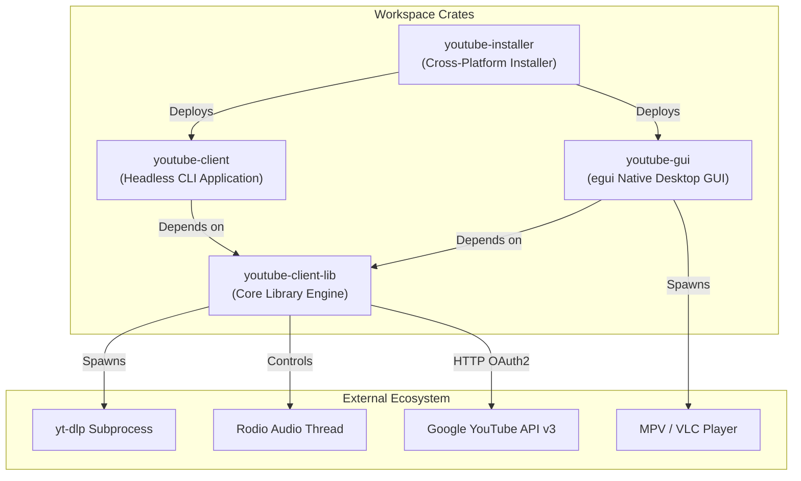
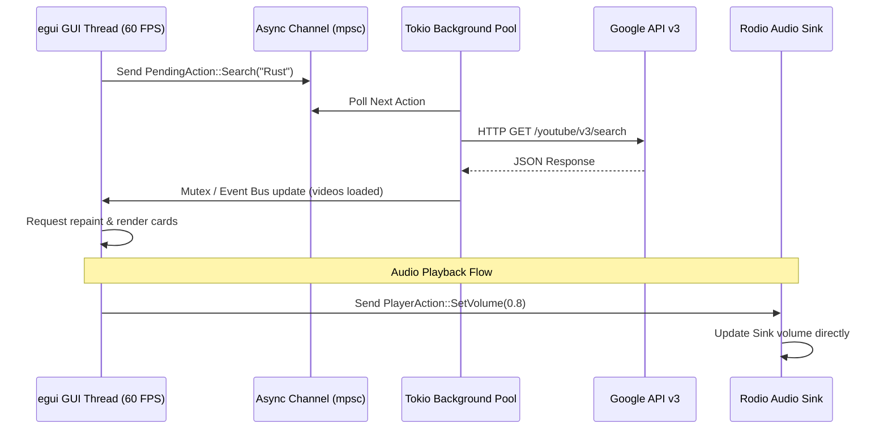
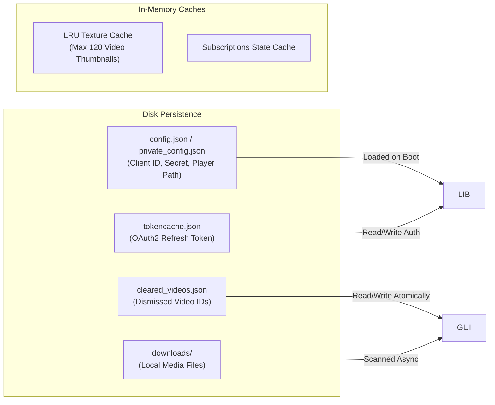

# Workspace Architecture & Design Specification

This document details the architectural design, component topology, concurrency model, and security boundaries across the `youtube-client` workspace.

---

## 1. System Topology & Crate Hierarchy

The workspace is organized as a Cargo workspace with four specialized crates adhering to strict separation of concerns:



### Crate Roles

1. **`youtube-client-lib`**: Pure asynchronous library providing authentication, YouTube Data API v3 bindings, media downloading abstractions, background audio decoding, retry logic, configuration resolution, and unit testing mocks.
2. **`youtube-client`**: Lightweight command-line interface wrapping `youtube-client-lib`. Built with `clap`, supporting 16 subcommands, ASCII tabular output, and machine-readable JSON streaming.
3. **`youtube-gui`**: Desktop graphical application built using `eframe` and `egui`. Features decoupled asynchronous background workers, an LRU texture cache, and an integrated audio control panel.
4. **`youtube-installer`**: Standalone installation and system management binary capable of building release binaries, configuring user `PATH` environment variables, creating shortcuts, verifying installations (`--verify`), and performing clean removals (`--uninstall`).

---

## 2. Implementation of the 10 Quality Attributes

The workspace architecture directly satisfies the **10 Attributes of a Well-Written Software Library & System**:

### Attribute 1: Intuitive API Design
* Fluent builder pattern with [`YoutubeClientBuilder`](file:///c:/Projects/youtube-client/youtube-client-lib/src/builder.rs) supporting step-by-step credentials and scope configuration.
* Strongly typed domain representations: [`Rating`](file:///c:/Projects/youtube-client/youtube-client-lib/src/models/rating.rs) (`Like`, `Dislike`, `None`), [`DownloadFormat`](file:///c:/Projects/youtube-client/youtube-client-lib/src/download.rs) (`Mp4`, `Mp3`, `BestAudio`, `Custom`), and generic [`Page<T>`](file:///c:/Projects/youtube-client/youtube-client-lib/src/models/page.rs).

### Attribute 2: Comprehensive Documentation
* Complete rustdoc documentation across all modules with executable doc-tests.
* Dedicated markdown guides in `docs/` covering CLI reference, configuration, GUI usage, installation, video playback, and developer testing.

### Attribute 3: High Reliability & Resilience
* **Exponential Backoff with Jitter:** [`retry_api_call`](file:///c:/Projects/youtube-client/youtube-client-lib/src/retry.rs) retries transient network errors and rate limits (`429`, `5xx`) up to 3 times with randomized backoff.
* **Atomic File Persistence:** [`write_json_atomically`](file:///c:/Projects/youtube-client/youtube-client-lib/src/utils.rs) writes state updates to a temporary sibling file (`.tmp`) before performing an atomic rename, preventing file corruption on unexpected termination.
* **Poison Recovery:** In `youtube-gui`, locks recover gracefully from poisoned mutexes via `.unwrap_or_else(|p| p.into_inner())`.

### Attribute 4: Performance & Efficiency
* **LRU Texture Cache:** In `youtube-gui`, remote video thumbnails are cached in an LRU queue capped at 120 textures, automatically dropping oldest textures to prevent unbounded VRAM growth.
* **Lazy Pagination:** `Page<T>` abstractions allow consumers to request only what is rendered, rather than fetching entire result sets upfront.
* **Non-Blocking UI Startup:** Directory scans for downloaded media in `youtube-gui` are delegated to background tasks to keep initial window launch under 16ms.

### Attribute 5: Maintainability
* Segregated service traits allow mocking and component isolation without coupling to concrete Google API clients.
* Centralized CLI execution context (`CliContext`) eliminates repetitive parameter lists.

### Attribute 6: Flexibility & Customization
* Download engine allows arbitrary extra yt-dlp arguments (`--arg`).
* Support for pluggable external media players (`player_path` in configuration).

### Attribute 7: Strong Security
* **Windows Reserved Name Protection:** [`sanitize_filename`](file:///c:/Projects/youtube-client/youtube-client-lib/src/utils.rs) rejects or neutralizes DOS device names (`CON`, `PRN`, `AUX`, `NUL`, `COM1-9`, `LPT1-9`).
* **Argument Injection Mitigation:** Output filenames are stripped of leading hyphens to prevent CLI argument injection, and arguments are escaped before subprocess invocation.
* **Token Permissions:** Clear guidelines on securing `tokencache.json` (`0600` permissions on Unix).

### Attribute 8: High Testability
* [`MockYoutubeClient`](file:///c:/Projects/youtube-client/youtube-client-lib/src/testing/mod.rs) implements all core service traits in memory, allowing comprehensive unit and UI testing without live Google API keys or quota consumption.
* CLI integration tests (`tests/cli_tests.rs`) validate all 16 commands against mock responses and `clap::Command::debug_assert()`.

### Attribute 9: Compatibility & Portability
* Normalized configuration directories:
  * Windows: `%APPDATA%\youtube-client`
  * Linux: `${XDG_CONFIG_HOME:-~/.config}/youtube-client`
  * macOS: `~/Library/Application Support/youtube-client`
* Cross-platform default player resolution supporting Windows (`mpv.exe`, `vlc.exe`), Linux (`/usr/bin/mpv`, `/usr/bin/vlc`), and macOS (`/Applications/VLC.app`).

### Attribute 10: Low Dependency Footprint
* Zero default features on `youtube-client-lib` (`default-features = false`).
* Elimination of dead/redundant dependencies (e.g. `rusty_ytdl` eliminated).

---

## 3. Service Traits & Dependency Injection

The core library isolates domain operations behind trait interfaces located in [`youtube-client-lib/src/traits/`](file:///c:/Projects/youtube-client/youtube-client-lib/src/traits):

```rust
#[async_trait::async_trait]
pub trait VideoService: Send + Sync {
    async fn list_videos(&self, channel_id: &str, limit: u32) -> Result<Vec<Video>>;
    async fn search_videos(&self, query: &str, limit: u32) -> Result<Vec<Video>>;
    async fn rate_video(&self, video_id: &str, rating: Rating) -> Result<()>;
    async fn fetch_video_details(&self, video_id: &str) -> Result<VideoDetails>;
}

#[async_trait::async_trait]
pub trait SubscriptionService: Send + Sync {
    async fn list_subscriptions(&self, limit: u32) -> Result<Vec<Subscription>>;
    async fn subscribe_to_channel(&self, channel_id: &str) -> Result<Subscription>;
    async fn unsubscribe_from_channel(&self, subscription_id: &str) -> Result<()>;
}

#[async_trait::async_trait]
pub trait PlaylistService: Send + Sync {
    async fn list_playlists(&self, limit: u32) -> Result<Vec<Playlist>>;
    async fn create_playlist(&self, title: &str, description: Option<&str>) -> Result<Playlist>;
    async fn delete_playlist(&self, playlist_id: &str) -> Result<()>;
    async fn add_to_playlist(&self, playlist_id: &str, video_id: &str) -> Result<()>;
}

#[async_trait::async_trait]
pub trait CommentService: Send + Sync {
    async fn fetch_comments(&self, video_id: &str, limit: u32) -> Result<Vec<Comment>>;
    async fn post_comment(&self, video_id: &str, text: &str) -> Result<Comment>;
}

#[async_trait::async_trait]
pub trait MediaDownloader: Send + Sync {
    async fn download_media(&self, options: &DownloadOptions) -> Result<PathBuf>;
}
```

Both [`YoutubeClient`](file:///c:/Projects/youtube-client/youtube-client-lib/src/client.rs) and [`MockYoutubeClient`](file:///c:/Projects/youtube-client/youtube-client-lib/src/testing/mod.rs) implement these traits, providing interchangeable live and simulated backends.

---

## 4. Concurrency & Threading Model

The application coordinates multiple execution runtimes to prevent UI blocking:



1. **GUI Frame Loop (egui):** Synchronous, immediate-mode rendering loop running on the main UI thread. It never performs blocking network requests or heavy disk I/O.
2. **Tokio Async Worker Pool:** Background task manager handling network requests, API queries, subprocess spawning (`yt-dlp`), and thumbnail image fetching.
3. **Rodio Audio Engine:** Dedicated hardware audio thread running via `rodio::OutputStream` and `rodio::Sink`. Communication from the GUI occurs via lightweight atomic commands.

---

## 5. Persistence & Cache Architecture



* **`tokencache.json`**: Stores OAuth2 token records, checked against `YOUTUBE_SCOPES` to ensure required authorization.
* **`cleared_videos.json`**: An atomic JSON file tracking dismissed video IDs in the New Videos feed. Items are read at startup and appended atomically upon user dismissal.
* **LRU Texture Cache**: In-memory FIFO/LRU structure tracking loaded textures with `egui::TextureHandle`. Once the capacity reaches 120 items, oldest handles are dropped, allowing the GPU driver to reclaim VRAM.
