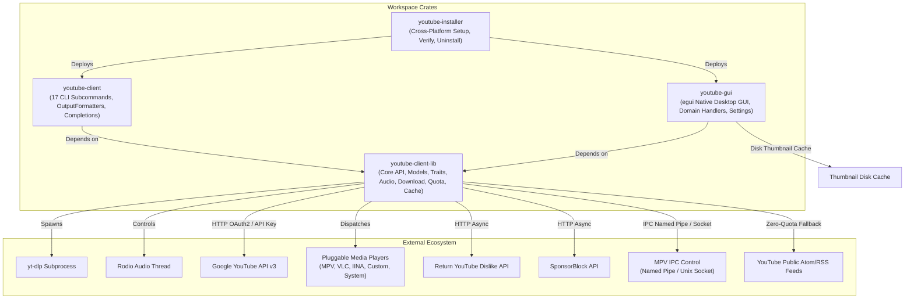
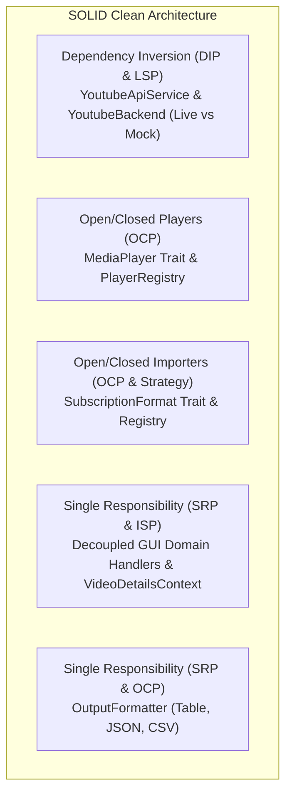
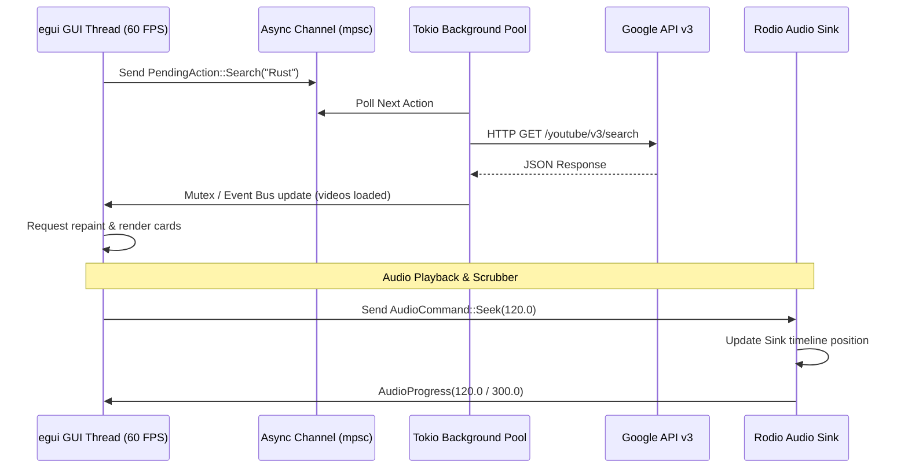
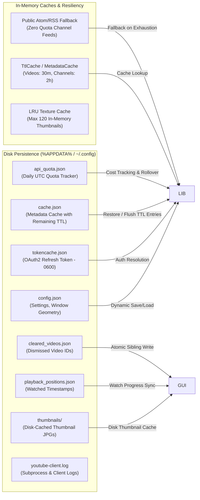

# Workspace Architecture & Design Specification (v0.2.0)

This document details the architectural design, component topology, concurrency model, persistence subsystems, and security boundaries across the `youtube-client` workspace.

---

## 1. System Topology & Crate Hierarchy

The workspace is structured as a Cargo workspace with four specialized crates adhering to strict separation of concerns and Clean Architecture:

```mermaid
graph TD
    subgraph "Workspace Crates"
        LIB["youtube-client-lib<br/>(Core API, Models, Traits, Audio, Download, Quota, Cache)"]
        CLI["youtube-client<br/>(17 CLI Subcommands, OutputFormatters, Completions)"]
        GUI["youtube-gui<br/>(egui Native Desktop GUI, Domain Handlers, Settings)"]
        INST["youtube-installer<br/>(Cross-Platform Setup, Verify, Uninstall)"]
    end

    subgraph "External Ecosystem"
        YTDL["yt-dlp Subprocess"]
        ROD["Rodio Audio Thread"]
        GAPI["Google YouTube API v3"]
        PLAY["Pluggable Media Players<br/>(MPV, VLC, IINA, Custom, System)"]
        RYD["Return YouTube Dislike API"]
        SB["SponsorBlock API"]
        MPV_IPC["MPV IPC Control<br/>(Named Pipe / Unix Socket)"]
        RSS["YouTube Public Atom/RSS Feeds"]
    end

    CLI -->|Depends on| LIB
    GUI -->|Depends on| LIB
    INST -->|Deploys| CLI
    GUI -->|Disk Thumbnail Cache| FS["Thumbnail Disk Cache"]
    INST -->|Deploys| GUI

    LIB -->|HTTP OAuth2 / API Key| GAPI
    LIB -->|Spawns| YTDL
    LIB -->|Controls| ROD
    LIB -->|HTTP Async| RYD
    LIB -->|HTTP Async| SB
    LIB -->|IPC Named Pipe / Socket| MPV_IPC
    LIB -->|Zero-Quota Fallback| RSS
    LIB -->|Dispatches| PLAY
```

### Crate Roles & Feature Flags

1. **`youtube-client-lib`**: Pure asynchronous library providing authentication (OAuth2 & API Key), YouTube Data API v3 bindings, media downloading abstractions with progress & cancellation, background audio decoding, retry logic, configuration resolution, quota budget tracking, disk-persistent TTL caching, SponsorBlock EDL segment generation, MPV IPC player controls, and pluggable player/importer registries.
   - **Feature Flags**:
     - `importers`: OPML, Google Takeout CSV, and NewPipe JSON subscription parsing.
     - `sponsorblock`: SponsorBlock segment retrieval and MPV EDL formatting.
     - `ipc`: Cross-platform MPV IPC controller over Windows named pipes and Unix sockets.
     - `full`: Enables all optional modules.
2. **`youtube-client`**: Lightweight command-line interface wrapping `youtube-client-lib`. Built with `clap`, supporting 17 subcommands, pluggable output formatters (`OutputFormatter<T>`: Table, JSON, CSV), zero-OAuth `--api-key` access, headless `login --device-code` authentication, and shell auto-completion generation.
3. **`youtube-gui`**: Desktop graphical application built using `eframe` and `egui`. Features decoupled domain action handlers (`handlers/auth`, `handlers/playback`, `handlers/settings`, etc.), interactive audio dock with scrubber slider, persistent watch progress tracking, RYD dislike metrics, persistent disk thumbnail caching, and an in-app Settings view.
4. **`youtube-installer`**: Standalone installation and system lifecycle management binary capable of compiling release binaries, configuring user `PATH` environment variables, creating shortcuts, verifying installations (`--verify`), and performing clean removals (`--uninstall`).

---

## 2. SOLID Architectural Pillars

The workspace is organized around the five foundational SOLID principles:

```mermaid
graph TD
    subgraph "SOLID Clean Architecture"
        DIP["Dependency Inversion (DIP & LSP)<br/>YoutubeApiService & YoutubeBackend (Live vs Mock)"]
        OCP1["Open/Closed Players (OCP)<br/>MediaPlayer Trait & PlayerRegistry"]
        OCP2["Open/Closed Importers (OCP & Strategy)<br/>SubscriptionFormat Trait & Registry"]
        SRP1["Single Responsibility (SRP & ISP)<br/>Decoupled GUI Domain Handlers & VideoDetailsContext"]
        SRP2["Single Responsibility (SRP & OCP)<br/>OutputFormatter (Table, JSON, CSV)"]
    end
```

### 1. Dependency Inversion & Liskov Substitution (DIP & LSP)
- **Composite Trait:** [`YoutubeApiService`](file:///c:/Projects/youtube-client/youtube-client-lib/src/traits/mod.rs) unifies domain service traits (`VideoService + SubscriptionService + PlaylistService + CommentService + Send + Sync`).
- **Adapter Pattern:** [`YoutubeBackend`](file:///c:/Projects/youtube-client/youtube-client-lib/src/backend.rs) wraps either `Live(Arc<YoutubeClient>)` or `Mock(MockYoutubeClient)`. Both variants implement all domain traits identically, enabling consumer applications (`youtube-gui` and `youtube-client`) to operate polymorphically without runtime trait object boxing overhead.
- **Offline Mock Injection:** `CliContext::with_mock` and `AppState::with_mock_backend` allow end-to-end integration and UI testing without live Google API keys or network access.

### 2. Pluggable Media Players (Open/Closed Principle)
- **Trait Contract:** [`MediaPlayer`](file:///c:/Projects/youtube-client/youtube-client-lib/src/player.rs) defines a unified launch interface for files and streams.
- **Implementations:** `MpvPlayer`, `VlcPlayer`, `IinaPlayer`, `CustomExecutablePlayer`, and `SystemDefaultPlayer`.
- **Registry:** [`PlayerRegistry`](file:///c:/Projects/youtube-client/youtube-client-lib/src/player.rs) auto-detects system player availability, matches user preferences, and propagates start offsets (`--start` for MPV, `--start-time` for VLC).

### 3. Pluggable Subscription Formats (Strategy Pattern)
- **Trait Contract:** [`SubscriptionFormat`](file:///c:/Projects/youtube-client/youtube-client-lib/src/importers.rs) defines format identification, content detection (`can_parse`), parsing, and serialization.
- **Implementations:** `OpmlFormat` (standard RSS/FreeTube/NewPipe OPML XML), `TakeoutCsvFormat` (Google Takeout `subscriptions.csv`), and `NewPipeJsonFormat`.
- **Universal Registry:** [`SubscriptionFormatRegistry`](file:///c:/Projects/youtube-client/youtube-client-lib/src/importers.rs) auto-detects file format on import without manual file format selection.

### 4. Decoupled GUI Domain Handlers (SRP & ISP)
- **Domain Handlers:** Monolithic event dispatching is partitioned into focused modules under [`youtube-gui/src/handlers/`](file:///c:/Projects/youtube-client/youtube-gui/src/handlers/):
  - `auth.rs`: Authentication, OAuth triggers, token cache purging, and account disconnection.
  - `navigation.rs`: View routing, history back-navigation, and view state initialization.
  - `playback.rs`: Embedded Rodio audio dispatch, external player execution with start offsets, and browser URL opening.
  - `download.rs`: Asynchronous media downloading via `yt-dlp` and progress state management.
  - `settings.rs`: Settings persistence and runtime directory synchronization.
  - `library.rs`: Subscriptions, channels, playlists, video details, comments, ratings, and OPML/CSV/JSON imports/exports.
- **Interface Segregation:** Replaced 12 loose view function parameters with [`VideoDetailsContext`](file:///c:/Projects/youtube-client/youtube-gui/src/views/details_view.rs).

### 5. Decoupled Terminal Output Formatters (SRP & OCP)
- **Trait Contract:** [`OutputFormatter<T>`](file:///c:/Projects/youtube-client/youtube-client/src/formatters.rs) separates data fetching from terminal presentation.
- **Implementations:**
  - `JsonFormatter`: Generic pretty-printed JSON serialization for any `serde::Serialize` model.
  - `CsvFormatter`: RFC-4180 compliant CSV export with proper escaping for `Video`, `Subscription`, `Playlist`, and `Comment`.
  - `TableFormatter`: Aligned tabular layouts and ASCII cards.
- **Pure Utility:** [`format_table`](file:///c:/Projects/youtube-client/youtube-client-lib/src/utils.rs) generates formatted strings independently of terminal `stdout` I/O.

### 6. Media Engine Resilience & Player Extensibility
- **Native SponsorBlock Skipping ([`sponsorblock.rs`](file:///c:/Projects/youtube-client/youtube-client-lib/src/sponsorblock.rs)):** Retrieves crowd-sourced skip segments (sponsor, intro, outro, self-promotion) and synthesizes native MPV EDL (`edl://`) stream URLs. Skips non-content sections natively without requiring external Lua plugins or scripts.
- **Bi-directional MPV IPC Client ([`mpv_ipc.rs`](file:///c:/Projects/youtube-client/youtube-client-lib/src/mpv_ipc.rs)):** Controls running MPV instances over Windows named pipes (`\\.\pipe\mpvsocket-...`) and Unix domain sockets (`/tmp/mpvsocket-...`). Supports pause, seek, volume, and playback timestamp queries.
- **Cooperative Download Cancellation & ETA ([`download.rs`](file:///c:/Projects/youtube-client/youtube-client-lib/src/download.rs)):** Emits structured [`DownloadProgress`](file:///c:/Projects/youtube-client/youtube-client-lib/src/download.rs) events with percentage, transfer speed, and ETA calculations, honoring cooperative abort tokens via [`tokio_util::sync::CancellationToken`](file:///c:/Projects/youtube-client/youtube-client-lib/src/download.rs).
- **Direct Rodio Audio Streaming ([`audio.rs`](file:///c:/Projects/youtube-client/youtube-client-lib/src/audio.rs)):** Streams extracted audio pipes (`yt-dlp` stdout) directly into Rodio's decoder, playing audio instantly in memory without writing intermediate files to disk.

---

## 3. Concurrency & Threading Model

The application coordinates multiple execution runtimes to prevent UI blocking:

```mermaid
sequenceDiagram
    participant UI as egui GUI Thread (60 FPS)
    participant CH as Async Channel (mpsc)
    participant TOK as Tokio Background Pool
    participant GAPI as Google API v3
    participant ROD as Rodio Audio Sink

    UI->>CH: Send PendingAction::Search("Rust")
    TOK->>CH: Poll Next Action
    TOK->>GAPI: HTTP GET /youtube/v3/search
    GAPI-->>TOK: JSON Response
    TOK->>UI: Mutex / Event Bus update (videos loaded)
    UI->>UI: Request repaint & render cards

    Note over UI,ROD: Audio Playback & Scrubber
    UI->>ROD: Send AudioCommand::Seek(120.0)
    ROD->>ROD: Update Sink timeline position
    ROD->>UI: AudioProgress(120.0 / 300.0)
```

1. **GUI Frame Loop (egui):** Synchronous, immediate-mode rendering loop running on the main UI thread. It never performs blocking network requests or heavy disk I/O.
2. **Tokio Async Worker Pool:** Background task manager handling network requests, API queries, subprocess spawning (`yt-dlp`), and thumbnail image fetching.
3. **Rodio Audio Engine:** Dedicated hardware audio thread running via `rodio::OutputStream` and `rodio::Sink`. Communication from the GUI occurs via lightweight atomic commands, tracking precise playback position and duration for timeline scrubbing.

---

## 4. Persistence, Caching & Quota Architecture

```mermaid
graph LR
    subgraph "Disk Persistence (%APPDATA% / ~/.config)"
        CONF["config.json<br/>(Settings, Window Geometry)"]
        TOK["tokencache.json<br/>(OAuth2 Refresh Token - 0600)"]
        CACHE["cache.json<br/>(Metadata Cache with Remaining TTL)"]
        THUMBS["thumbnails/<br/>(Disk-Cached Thumbnail JPGs)"]
        QUOTA["api_quota.json<br/>(Daily UTC Quota Tracker)"]
        POS["playback_positions.json<br/>(Watched Timestamps)"]
        CLR["cleared_videos.json<br/>(Dismissed Video IDs)"]
        LOG["youtube-client.log<br/>(Subprocess & Client Logs)"]
    end

    subgraph "In-Memory Caches & Resiliency"
        TTL["TtlCache / MetadataCache<br/>(Videos: 30m, Channels: 2h)"]
        RSS["Public Atom/RSS Fallback<br/>(Zero Quota Channel Feeds)"]
        TEX["LRU Texture Cache<br/>(Max 120 In-Memory Thumbnails)"]
    end

    CONF -->|Dynamic Save/Load| LIB
    TOK -->|Auth Resolution| LIB
    CACHE -->|Restore / Flush TTL Entries| LIB
    THUMBS -->|Disk Thumbnail Cache| GUI
    QUOTA -->|Cost Tracking & Rollover| LIB
    POS -->|Watch Progress Sync| GUI
    CLR -->|Atomic Sibling Write| GUI
    TTL -->|Cache Lookup| LIB
    RSS -->|Fallback on Exhaustion| LIB
```

* **`config.json`**: Dynamic user configuration (preferred player, downloads directory, browser cookies, and window geometry coordinates/dimensions).
* **`tokencache.json`**: Stores OAuth2 token records with strict security permissions (`0600` on Unix).
* **`cache.json` (`MetadataCache`)**: Disk-backed atomic cache storing video and channel metadata across application runs. Automatically computes remaining TTL on reload so expired entries are discarded immediately.
* **`thumbnails/`**: Persistent thumbnail directory caching retrieved image bytes locally, eliminating duplicate network fetches.
* **`api_quota.json`**: Daily YouTube Data API v3 consumption tracker with daily UTC rollover.
* **`playback_positions.json`**: Per-video watch timestamps (`position_secs`, `duration_secs`, `updated_at`) written atomically.
* **`cleared_videos.json`**: Dismissed video IDs in the New Videos feed.
* **`TtlCache<K, V>`**: Thread-safe in-memory cache with configurable time-to-live, slashing redundant API requests.
* **Public RSS Fallback**: Atom XML parsing via `quick-xml` that fetches channel uploads without requiring API keys or quota consumption.
* **LRU Texture Cache**: In-memory FIFO/LRU structure tracking loaded textures with `egui::TextureHandle` capped at 120 items.

---

## 5. Implementation of the 10 Quality Attributes

| Attribute | Implementation Details |
| :--- | :--- |
| **1. Intuitive API Design** | Fluent builder [`YoutubeClientBuilder`](file:///c:/Projects/youtube-client/youtube-client-lib/src/builder.rs); strongly typed models ([`Rating`](file:///c:/Projects/youtube-client/youtube-client-lib/src/models/rating.rs), [`DownloadFormat`](file:///c:/Projects/youtube-client/youtube-client-lib/src/download.rs), [`Page<T>`](file:///c:/Projects/youtube-client/youtube-client-lib/src/models/page.rs)). |
| **2. Comprehensive Documentation** | Complete rustdoc with executable doc-tests; 10 specialized markdown guides in `docs/`; 4 standalone runnable examples in `examples/`. |
| **3. High Reliability & Resilience** | Exponential backoff with jitter ([`retry_api_call`](file:///c:/Projects/youtube-client/youtube-client-lib/src/retry.rs)); atomic sibling file writes ([`write_json_atomically`](file:///c:/Projects/youtube-client/youtube-client-lib/src/utils.rs)); mutex poison recovery; cooperative cancellation. |
| **4. Performance & Efficiency** | Capped LRU texture queue (120 textures); lazy stream pagination (`BoxStream<'a, T>`); chunked batch video fetching (`get_videos_batch`); persistent disk caching. |
| **5. Maintainability** | Segregated service traits; decoupled domain handlers (`handlers/`); isolated presentation (`OutputFormatter`); feature flags (`sponsorblock`, `ipc`, `importers`). |
| **6. Flexibility & Customization** | Pluggable media player registry; SponsorBlock EDL generation; MPV IPC control; arbitrary yt-dlp arguments; multi-format subscription importers. |
| **7. Strong Security** | Filename sanitization ([`sanitize_filename`](file:///c:/Projects/youtube-client/youtube-client-lib/src/utils.rs)); command injection protection; sensitive token permissions (`0600`); zero-OAuth API key support. |
| **8. High Testability** | In-memory [`MockYoutubeClient`](file:///c:/Projects/youtube-client/youtube-client-lib/src/testing/mod.rs); 79 automated unit and integration tests; offline CLI/GUI testing via `YoutubeBackend`. |
| **9. Compatibility & Portability** | Centralized standard OS app data directories (`%APPDATA%`, `~/.config`); cross-platform media player discovery; cross-platform named pipe/Unix socket IPC. |
| **10. Low Dependency Footprint** | Modular feature flags on `youtube-client-lib`; no bloated framework dependencies. |
