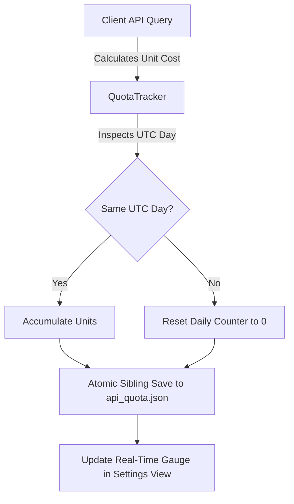

# API Quota Management, Caching & Resiliency Guide

**Workspace:** `youtube-client`  
**Target Version:** 0.2.0  

---

## 1. YouTube Data API v3 Quota Economics

The YouTube Data API v3 enforces a strict daily quota limit (typically **10,000 units per day** on free tier developer projects). Different API operations incur wildly disparate quota costs:

| Operation | Typical Endpoint | Quota Unit Cost | Notes |
| :--- | :--- | :---: | :--- |
| **Search Queries** | `/youtube/v3/search` | **100 units** | Very expensive. 100 searches completely exhausts daily quota. |
| **Video Metadata Reads** | `/youtube/v3/videos?part=snippet,statistics` | **1 unit** | Inexpensive. |
| **Channel Profile Reads** | `/youtube/v3/channels?part=snippet,statistics` | **1 unit** | Inexpensive. |
| **Playlist Item Reads** | `/youtube/v3/playlistItems` | **1 unit** | Inexpensive. |
| **Comment Thread Reads** | `/youtube/v3/commentThreads` | **1 unit** | Inexpensive. |
| **Comment Post (Write)** | `/youtube/v3/comments` (POST) | **50 units** | Moderately expensive mutation. |
| **Rating (Write)** | `/youtube/v3/videos/rate` (POST) | **50 units** | Moderately expensive mutation. |
| **Playlist Create / Delete** | `/youtube/v3/playlists` (POST/DELETE) | **50 units** | Moderately expensive mutation. |
| **Public RSS Atom Fallback** | `https://www.youtube.com/feeds/videos.xml` | **0 units** | Completely free; zero API keys required. |

Without active budget tracking and aggressive caching, desktop clients can easily exhaust their daily budget within hours of regular browsing.

---

## 2. The `QuotaTracker` Subsystem

`youtube-client-lib` includes an autonomous [`QuotaTracker`](file:///c:/Projects/youtube-client/youtube-client-lib/src/quota.rs) that records API consumption locally:



### Key Behaviors:
1. **Daily UTC Rollover:** Google resets API quotas at midnight Pacific Time / UTC. `QuotaTracker` tracks current date in UTC (`YYYY-MM-DD`). Upon detecting a new UTC calendar day, it automatically resets the counter to zero.
2. **Atomic Persistence:** Quota metrics are saved atomically to `%APPDATA%/youtube-client/api_quota.json` (or `~/.config/youtube-client/api_quota.json`).
3. **Usage Breakdown:** Records searches, read queries, mutations, and total units consumed.
4. **Exhaustion Guard:** Emits warnings when usage crosses 80% and 95% of the daily limit.

---

## 3. In-Memory TTL Metadata Caching (`TtlCache`)

To eliminate redundant network calls, `youtube-client-lib` provides [`TtlCache<K, V>`](file:///c:/Projects/youtube-client/youtube-client-lib/src/cache.rs):

### Cache Configurations

1. **Video Metadata Cache:**
   - **Key:** Video ID (`String`)
   - **Value:** `VideoDetails`
   - **TTL:** 30 minutes
   - Prevents re-fetching identical video descriptions, statistics, and tags when navigating between feed and details views.
2. **Channel Profile Cache:**
   - **Key:** Channel ID (`String`)
   - **Value:** `ChannelDetails`
   - **TTL:** 2 hours
   - Eliminates repeated queries when browsing multiple uploads from the same creator.

### Cache Mechanics
* Thread-safe access via `Arc<RwLock<...>>`.
* Stale entries are lazily evicted on lookup or proactively pruned during periodic cleanup.
* Automatically disabled in `MockYoutubeClient` during testing to ensure deterministic test assertions.

---

## 4. Zero-Quota Public RSS Atom XML Fallback

When viewing uploads from a channel, `youtube-client-lib` provides a zero-quota fallback mechanism via public YouTube Atom/RSS feeds:

```
https://www.youtube.com/feeds/videos.xml?channel_id=<CHANNEL_ID>
```

### Capabilities & Guarantees:
* **0 Quota Consumption:** Requires zero YouTube Data API keys and zero quota units.
* **Parsed via [`parse_youtube_rss_xml`](file:///c:/Projects/youtube-client/youtube-client-lib/src/rss.rs):** Extracts video IDs, titles, publication dates, and highest-resolution media thumbnails.
* **Automatic Fallback:** In `youtube-gui`, if the YouTube Data API returns an HTTP 403 quota exhaustion error or network failure, the application automatically falls back to public RSS feeds to keep channel video browsing functional.

---

## 5. Real-Time GUI Quota Budget Card

The **Settings** view in `youtube-gui` renders an interactive visual budget gauge:

```
┌─────────────────────────────────────────────────────────────┐
│  📊 Daily API Quota Budget (10,000 units)                   │
├─────────────────────────────────────────────────────────────┤
│  Used: 1,450 / 10,000 units [██████░░░░░░░░░░░░░░░░░] 14.5% │
│                                                             │
│  Breakdown:                                                 │
│  • Searches:   12 (1,200 units)                             │
│  • Reads:     200 (  200 units)                             │
│  • Mutations:   1 (   50 units)                             │
│                                                             │
│  Status: Healthy (Resets at midnight UTC)                   │
└─────────────────────────────────────────────────────────────┘
```

The gauge dynamically transitions from **Green** (< 70%) to **Yellow** (70–90%) and **Red** (> 90%), offering users instant visibility into their API budget.
