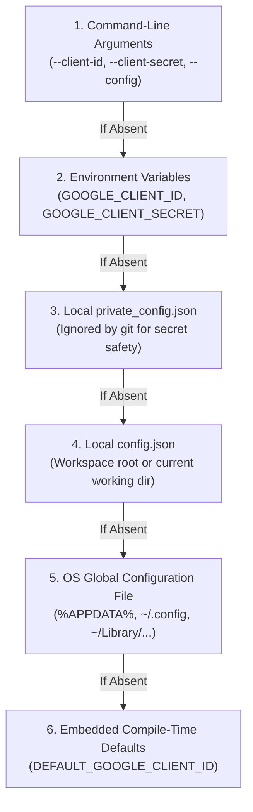

# Configuration & Secrets Management Guide

This document defines how the YouTube Client ecosystem manages API credentials, local settings, media player paths, and token caches.

---

## 1. Configuration Resolution Precedence

When initializing a client connection or starting the GUI, configuration settings are resolved using a **strict 6-tier fallback hierarchy**:



### Precedence Details

1. **Command-Line Arguments**: Flags passed directly to `youtube-client` (e.g. `--client-id "XYZ" --client-secret "ABC"`).
2. **Environment Variables**:
   * `GOOGLE_CLIENT_ID`: Overrides the Google OAuth2 Client ID.
   * `GOOGLE_CLIENT_SECRET`: Overrides the Google OAuth2 Client Secret.
3. **Local `private_config.json`**: Checked in the current working directory. This file is explicitly listed in `.gitignore` to prevent accidental credential commits.
4. **Local `config.json`**: Fallback configuration file in the current working directory.
5. **OS Global User Configuration Directory**:
   * **Windows**: `%APPDATA%\youtube-client\config.json` (typically `C:\Users\<User>\AppData\Roaming\youtube-client\config.json`)
   * **macOS**: `~/Library/Application Support/youtube-client/config.json`
   * **Linux / BSD**: `${XDG_CONFIG_HOME:-~/.config}/youtube-client/config.json`
6. **Compile-Time Defaults**: Built-in OAuth credentials embedded at compile time via `option_env!("DEFAULT_GOOGLE_CLIENT_ID")` and `option_env!("DEFAULT_GOOGLE_CLIENT_SECRET")`.

---

## 2. Configuration File Schema

Configuration files (`config.json` or `private_config.json`) use standard JSON formatting:

```json
{
  "client_id": "YOUR_CLIENT_ID.apps.googleusercontent.com",
  "client_secret": "YOUR_CLIENT_SECRET",
  "player_path": "C:\\Program Files\\mpv\\mpv.exe",
  "downloads_dir": "C:\\Users\\User\\Downloads\\YouTube"
}
```

### Field Definitions

| Property | Type | Required | Description |
| :--- | :---: | :---: | :--- |
| `client_id` | String | No* | Google OAuth2 Desktop Client ID. |
| `client_secret` | String | No* | Google OAuth2 Desktop Client Secret. |
| `player_path` | String | No | Absolute path to preferred media player (`mpv`, `vlc`). |
| `downloads_dir` | String | No | Default destination folder for downloaded media files. |

*\* If not supplied in the file, credentials fall back to environment variables or embedded defaults.*

> [!NOTE]
> On Windows, remember to use double backslashes (`\\`) in JSON file paths, or forward slashes (`/`).

---

## 3. Token Cache Storage & Security

### File Location: `tokencache.json`

During the `login` flow, Google OAuth2 tokens (access token, token type, expiry, refresh token, granted scopes) are saved to disk.

* **Resolution:**
  1. The client checks for `tokencache.json` in the current working directory.
  2. If absent locally, the client checks the OS global config directory (`get_global_config_dir()`).
* **Security & Permissions:**
  * Because `tokencache.json` contains active refresh tokens granting access to your YouTube account, it must never be shared or committed to source control.
  * On Linux and macOS, it is strongly recommended to restrict permissions to the current user:
    ```bash
    chmod 600 tokencache.json
    ```

### Scope Verification

Whenever a client starts, `check_token_cache_scopes` inspects the cached token scopes against the application's required scopes (`YOUTUBE_SCOPES`):
* `https://www.googleapis.com/auth/youtube`
* `https://www.googleapis.com/auth/youtube.force-ssl`
* `https://www.googleapis.com/auth/youtube.readonly`

If your cached token was created under older or insufficient scopes (e.g. read-only), delete `tokencache.json` and re-run:
```bash
cargo run --bin youtube-client -- login
```

---

## 4. Setup Examples

### Example A: Individual Developer (Private Config)

Create `private_config.json` in your repository root:
```json
{
  "client_id": "YOUR_CLIENT_ID.apps.googleusercontent.com",
  "client_secret": "YOUR_CLIENT_SECRET",
  "player_path": "C:\\Program Files\\mpv\\mpv.exe"
}
```

### Example B: Headless Server / CI Environment (Environment Variables)

In Bash:
```bash
export GOOGLE_CLIENT_ID="YOUR_CLIENT_ID"
export GOOGLE_CLIENT_SECRET="YOUR_CLIENT_SECRET"
youtube-client subscriptions --all --json > subscriptions.json
```

In PowerShell:
```powershell
$env:GOOGLE_CLIENT_ID="YOUR_CLIENT_ID"
$env:GOOGLE_CLIENT_SECRET="YOUR_CLIENT_SECRET"
youtube-client subscriptions --all --json | Out-File subscriptions.json
```

### Example C: System-Wide User Installation

Place `config.json` in your user's roaming application directory:
* **Windows**: `%APPDATA%\youtube-client\config.json`
* **Linux**: `~/.config/youtube-client/config.json`

The installer (`youtube-installer`) can automatically configure this global location for you.
