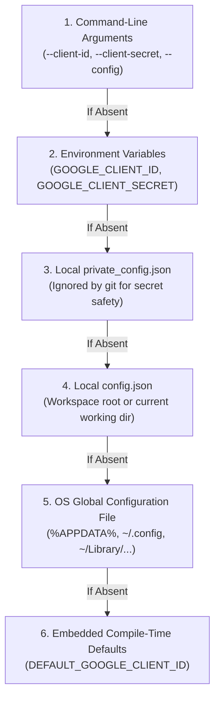

# Configuration, State & Secrets Management Guide (v0.2.0)

This document defines how the YouTube Client ecosystem manages API credentials, local settings, media player paths, window geometry, persistent session states, and security tokens.

---

## 1. Centralized Application Data Paths

All client configuration, caches, and persistent state files are stored in standard OS application data directories resolved via [`resolve_app_data_path(file_name)`](file:///c:/Projects/youtube-client/youtube-client-lib/src/config.rs):

* **Windows:** `%APPDATA%\youtube-client\` (e.g. `C:\Users\<User>\AppData\Roaming\youtube-client\`)
* **Linux / BSD:** `${XDG_CONFIG_HOME:-~/.config}/youtube-client/`
* **macOS:** `~/Library/Application Support/youtube-client/`

If the directory does not exist, the library automatically creates it with proper security guardrails.

---

## 2. Configuration Resolution Precedence

When initializing a client connection or starting the GUI, configuration settings are resolved using a **strict 6-tier fallback hierarchy**:


```mermaid
graph TD
    T1["1. Command-Line Arguments<br/>(--client-id, --client-secret, --config)"] -->|If Absent| T2["2. Environment Variables<br/>(GOOGLE_CLIENT_ID, GOOGLE_CLIENT_SECRET)"]
    T2 -->|If Absent| T3["3. Local private_config.json<br/>(Ignored by git for secret safety)"]
    T3 -->|If Absent| T4["4. Local config.json<br/>(Workspace root or current working dir)"]
    T4 -->|If Absent| T5["5. OS Global Configuration File<br/>(%APPDATA%, ~/.config, ~/Library/...)"]
    T5 -->|If Absent| T6["6. Embedded Compile-Time Defaults<br/>(DEFAULT_GOOGLE_CLIENT_ID)"]
```

### Precedence Details

1. **Command-Line Arguments**: Flags passed directly to `youtube-client` (e.g. `--client-id "XYZ" --client-secret "ABC"`, `--log-file "custom.log"`).
2. **Environment Variables**:
   * `GOOGLE_CLIENT_ID`: Overrides the Google OAuth2 Client ID.
   * `GOOGLE_CLIENT_SECRET`: Overrides the Google OAuth2 Client Secret.
   * `YOUTUBE_CLIENT_LOG_FILE`: Overrides the destination client log file path.
   * `YOUTUBE_COOKIES_FILE`: Overrides the path to a Netscape `cookies.txt` file.
   * `YOUTUBE_COOKIES_FROM_BROWSER`: Overrides browser cookie extraction (`chrome`, `firefox`, etc.).
3. **Local `private_config.json`**: Checked in the current working directory. This file is explicitly listed in `.gitignore` to prevent accidental credential commits.
4. **Local `config.json`**: Fallback configuration file in the current working directory.
5. **OS Global User Configuration Directory**:
   * **Windows**: `%APPDATA%\youtube-client\config.json`
   * **macOS**: `~/Library/Application Support/youtube-client/config.json`
   * **Linux / BSD**: `${XDG_CONFIG_HOME:-~/.config}/youtube-client/config.json`
6. **Compile-Time Defaults**: Built-in OAuth credentials embedded at compile time via `option_env!("DEFAULT_GOOGLE_CLIENT_ID")` and `option_env!("DEFAULT_GOOGLE_CLIENT_SECRET")`. Default log file falls back to `youtube-client.log`.

---

## 3. Configuration File Schema (`config.json`)

Configuration files (`config.json` or `private_config.json`) use standard JSON formatting and support dynamic in-app updating via the GUI Settings view:

```json
{
  "client_id": "YOUR_CLIENT_ID.apps.googleusercontent.com",
  "client_secret": "YOUR_CLIENT_SECRET",
  "player_path": "C:\\Program Files\\mpv\\mpv.exe",
  "downloads_dir": "C:\\Users\\User\\Downloads\\YouTube",
  "log_file": "C:\\Users\\User\\AppData\\Roaming\\youtube-client\\youtube-client.log",
  "cookies_file": "C:\\Users\\User\\cookies.txt",
  "cookies_from_browser": "firefox",
  "window_pos": [150.0, 100.0],
  "window_size": [1280.0, 800.0],
  "window_maximized": false
}
```

### Field Definitions

| Property | Type | Required | Description |
| :--- | :---: | :---: | :--- |
| `client_id` | String | No* | Google OAuth2 Desktop Client ID. |
| `client_secret` | String | No* | Google OAuth2 Desktop Client Secret. |
| `player_path` | String | No | Absolute path to preferred media player (`mpv`, `vlc`, custom executable). |
| `downloads_dir` | String | No | Default destination folder for downloaded media files. |
| `log_file` | String | No | Destination path for client logs, yt-dlp progress, and ffmpeg traces. |
| `cookies_file` | String | No | Path to Netscape-format `cookies.txt` file for authenticated extraction. |
| `cookies_from_browser` | String | No | Browser name to extract cookies from (`chrome`, `firefox`, `edge`, `brave`). |
| `window_pos` | `[f32, f32]` | No | Last remembered window screen coordinates `[x, y]`. |
| `window_size` | `[f32, f32]` | No | Last remembered window dimensions `[width, height]`. |
| `window_maximized` | Boolean | No | Whether the window was maximized on last exit. |

*\* If not supplied in the file, credentials fall back to environment variables or embedded defaults.*

---

## 4. Persistent State Files Catalog

The YouTube Client suite uses atomic sibling writes (`write_json_atomically`) to manage persistent states without file corruption:

| File Name | Purpose | Location |
| :--- | :--- | :--- |
| **`config.json`** | Settings, preferred player, downloads folder, and window geometry. | `%APPDATA%/youtube-client/config.json` |
| **`tokencache.json`** | OAuth2 refresh and access token records with permissions. | `%APPDATA%/youtube-client/tokencache.json` |
| **`api_quota.json`** | Daily YouTube Data API v3 unit usage tracker with daily UTC rollover. | `%APPDATA%/youtube-client/api_quota.json` |
| **`playback_positions.json`** | Per-video watched timestamps (`position_secs`, `duration_secs`). | `%APPDATA%/youtube-client/playback_positions.json` |
| **`cleared_videos.json`** | Dismissed video ID hashes for the New Videos feed. | `%APPDATA%/youtube-client/cleared_videos.json` |
| **`youtube-client.log`** | Background `yt-dlp` logs, `ffmpeg` traces, and diagnostics. | `%APPDATA%/youtube-client/youtube-client.log` |

---

## 5. Token Cache Security & Verification

### File Permissions
Because `tokencache.json` contains active refresh tokens granting access to your YouTube account:
* `youtube-client-lib` automatically invokes [`secure_sensitive_file`](file:///c:/Projects/youtube-client/youtube-client-lib/src/config.rs) on Unix platforms to enforce `0600` permissions (read/write only by owner).
* Never share or commit `tokencache.json` to source control.

### Scope Verification
Whenever a client starts, `check_token_cache_scopes` inspects the cached token scopes against the application's required scopes (`YOUTUBE_SCOPES`):
* `https://www.googleapis.com/auth/youtube`
* `https://www.googleapis.com/auth/youtube.force-ssl`
* `https://www.googleapis.com/auth/youtube.readonly`

If your cached token was created under older or insufficient scopes (e.g. read-only), delete `tokencache.json` (or click **"Sign Out & Disconnect Account"** in the Settings view) and re-authenticate.
