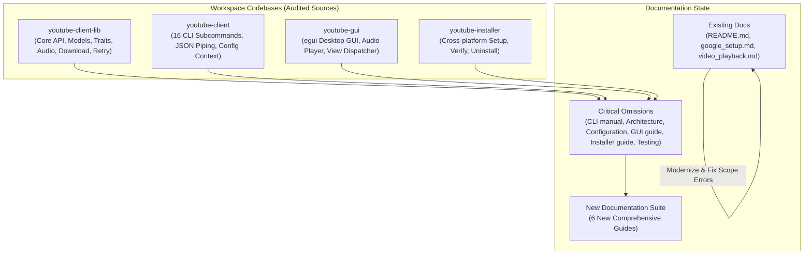
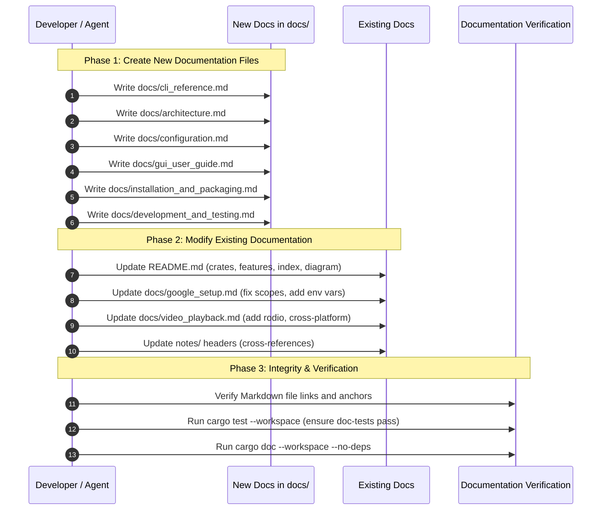

# Comprehensive Workspace Documentation Plan

> **Workspace Scope:** `youtube-client-lib`, `youtube-client`, `youtube-gui`, `youtube-installer`  
> **Source Analysis Date:** September 2026  
> **Target Version:** 0.1.2+ (Quality Attributes & Full Feature Implementation)

---

## 1. Executive Summary & Source Code Audit

A thorough audit of the `youtube-client` workspace source code was conducted to determine the alignment between the codebase and its documentation. While recent architectural refactoring successfully implemented the **10 Attributes of a Well-Written Software Library** and expanded features across all four crates, the repository documentation remains sparse and in several areas outdated.



### Key Audit Findings

1. **Undocumented CLI Expansion (16 Commands):**
   The CLI in [`youtube-client/src/lib.rs`](file:///c:/Projects/youtube-client/youtube-client/src/lib.rs) now implements 16 subcommands: `login`, `subscriptions`, `videos`, `search`, `rate`, `playlists`, `download`, `play`, `details`, `channel`, `comments`, `comment-post`, `subscribe`, `unsubscribe`, `playlist-create`, and `playlist-delete`. However, there is no CLI reference manual, no documented JSON piping recipes, and no parameter documentation outside of `clap --help`.

2. **Inaccurate Scope Documentation in [`docs/google_setup.md`](file:///c:/Projects/youtube-client/docs/google_setup.md):**
   The existing Google setup guide instructs users to configure only `/auth/youtube.readonly`. However, interactive features added to the library and CLI/GUI (commenting, playlist creation/deletion, rating, subscribing) require write scopes defined in [`youtube-client-lib/src/client.rs:21-25`](file:///c:/Projects/youtube-client/youtube-client-lib/src/client.rs#L21-L25):
   * `https://www.googleapis.com/auth/youtube`
   * `https://www.googleapis.com/auth/youtube.force-ssl`
   * `https://www.googleapis.com/auth/youtube.readonly`
   Following the existing guide leads directly to `403 Forbidden` API errors for write operations.

3. **Missing `youtube-installer` Documentation:**
   [`youtube-installer`](file:///c:/Projects/youtube-client/youtube-installer) supports interactive prompts, unattended installation (`-y` / `--yes`, `--target-dir`), registry/environment PATH persistence, Start Menu/desktop shortcuts, integrity verification (`--verify`), and uninstallation (`--uninstall`). It is not mentioned anywhere in `README.md` or `docs/`.

4. **Undocumented Multi-Tier Configuration & Secret Resolution:**
   [`youtube-client-lib/src/config.rs`](file:///c:/Projects/youtube-client/youtube-client-lib/src/config.rs) supports CLI flags, environment variables (`GOOGLE_CLIENT_ID`, `GOOGLE_CLIENT_SECRET`), compile-time embedded credentials (`DEFAULT_GOOGLE_CLIENT_ID`, `DEFAULT_GOOGLE_CLIENT_SECRET`), local `private_config.json`, local `config.json`, and OS-specific global directories (`%APPDATA%`, `~/.config`, `~/Library/Application Support`). Users and developers have no single reference for this resolution hierarchy.

5. **Undocumented Native GUI Capabilities:**
   [`youtube-gui`](file:///c:/Projects/youtube-client/youtube-gui) features real-time subscription filtering, cleared video feed caching, inline playlist management, detailed engagement metrics, interactive commenting, background Rodio audio playback with volume/mute controls, and MPV/VLC video streaming. None of these UI flows are documented for end users.

6. **Undocumented Architectural Patterns & Testing Harness:**
   The workspace includes trait-based dependency injection (`VideoService`, `PlaylistService`, `CommentService`, `SubscriptionService`, `MediaDownloader`), unit mock fixtures (`MockYoutubeClient`), atomic JSON file writers, resilient retry mechanisms, and CLI automated integration tests (`tests/cli_tests.rs`). Contributors have no guide for architecture, development, or testing.

---

## 2. Documentation Gap Matrix

| Component / Feature Area | Active Code Implementation | Current Doc Status | Planned Documentation Action |
| :--- | :--- | :--- | :--- |
| **Workspace Overview** | 4 crates (`lib`, `client`, `gui`, `installer`) | `README.md` lists only 3 crates, lacks installer | **Modify [`README.md`](file:///c:/Projects/youtube-client/README.md)**: add `youtube-installer`, full feature matrix, quickstart, and doc index |
| **Google Cloud Authentication** | Full read/write scopes, env vars, token cache | `docs/google_setup.md` only covers readonly, lacks env vars | **Modify [`docs/google_setup.md`](file:///c:/Projects/youtube-client/docs/google_setup.md)**: correct scopes, env var setup, token invalidation |
| **Video Playback & Media** | MPV, VLC, browser fallback, Rodio audio player | `docs/video_playback.md` lacks Rodio audio, yt-dlp options, CLI `play` | **Modify [`docs/video_playback.md`](file:///c:/Projects/youtube-client/docs/video_playback.md)**: add Rodio details, CLI play, yt-dlp arguments |
| **CLI Client Reference** | 16 subcommands, `--json` output, pagination, flags | Completely missing | **Create [`docs/cli_reference.md`](file:///c:/Projects/youtube-client/docs/cli_reference.md)**: exhaustive syntax, options, JSON piping with `jq`, shell examples |
| **Architecture & Design** | Trait segregation, mock harness, retry, LRU cache | High-level notes in `notes/refactor_plan.md` only | **Create [`docs/architecture.md`](file:///c:/Projects/youtube-client/docs/architecture.md)**: 10 quality attributes, data flow, concurrency, traits, models |
| **Configuration & Secrets** | CLI flags, env vars, config files, OS global paths | Fragmented across `google_setup.md` and code comments | **Create [`docs/configuration.md`](file:///c:/Projects/youtube-client/docs/configuration.md)**: resolution hierarchy, file schemas, credentials security |
| **Desktop GUI Guide** | egui views, audio bar, search filter, feed clearing | Completely missing | **Create [`docs/gui_user_guide.md`](file:///c:/Projects/youtube-client/docs/gui_user_guide.md)**: complete walkthrough of views, hotkeys, audio bar |
| **Installation & Packaging** | `youtube-installer`, `--yes`, `--verify`, `--uninstall` | Completely missing | **Create [`docs/installation_and_packaging.md`](file:///c:/Projects/youtube-client/docs/installation_and_packaging.md)**: installer usage, verification, uninstallation |
| **Development & Testing** | `MockYoutubeClient`, `cargo test`, `cli_tests.rs` | Completely missing | **Create [`docs/development_and_testing.md`](file:///c:/Projects/youtube-client/docs/development_and_testing.md)**: build guides, unit & mock tests, CI guidelines |

---

## 3. Concrete Specifications for New Documents

### 3.1 [`docs/cli_reference.md`](file:///c:/Projects/youtube-client/docs/cli_reference.md) — CLI Reference Manual

* **Target Audience:** Terminal users, system administrators, automation scripts.
* **Core Content:**
  1. **Global Options:** `--config <FILE>`, `--token-cache <FILE>`, `--client-id <ID>`, `--client-secret <SECRET>`.
  2. **Detailed Command Matrix (All 16 Subcommands):**
     * `login`: Interactive browser OAuth2 authentication flow.
     * `subscriptions`: `--limit <N>`, `--page-token <TOKEN>`, `--all`, `--json`.
     * `videos`: `--channel-id <ID>`, `--limit <N>`, `--page-token <TOKEN>`, `--json`.
     * `search`: `--query <STRING>`, `--limit <N>`, `--page-token <TOKEN>`, `--json`.
     * `rate`: `--video-id <ID>`, `--rating <like|dislike|none>`.
     * `playlists`: `--limit <N>`, `--playlist-id <ID>`, `--json`.
     * `download`: `--video-id <ID>`, `--output <PATH>`, `--format <mp4|mp3|bestaudio|custom>`, `--quality <RES>`, `--arg <EXTRA>`.
     * `play`: `--file <PATH>`, `--system`.
     * `details`: `--video-id <ID>`, `--json`.
     * `channel`: `--channel-id <ID>`, `--json`.
     * `comments`: `--video-id <ID>`, `--limit <N>`, `--json`.
     * `comment-post`: `--video-id <ID>`, `--text <STRING>`.
     * `subscribe`: `--channel-id <ID>`.
     * `unsubscribe`: `--subscription-id <ID>`.
     * `playlist-create`: `--title <TITLE>`, `--description <DESC>`.
     * `playlist-delete`: `--playlist-id <ID>`.
  3. **Shell Scripting & Pipelining Recipes:**
     * Extracting video titles with `jq`: `youtube-client subscriptions --all --json | jq -r '.[].title'`.
     * Batch downloading audio tracks: piping video IDs into `youtube-client download --format mp3`.
     * Searching and playing top result in MPV.
  4. **Exit Codes & Error Handling:** Explanation of non-zero exits, network timeout retries, and quota exhaustion warnings.

---

### 3.2 [`docs/architecture.md`](file:///c:/Projects/youtube-client/docs/architecture.md) — Architecture & Design Guide

* **Target Audience:** Library consumers, core developers, system architects.
* **Core Content:**
  1. **Workspace Topography:**
     * Boundary contracts between `youtube-client-lib` (backend engine) and consumers (`youtube-client`, `youtube-gui`).
     * `youtube-installer` as an out-of-band delivery tool.
  2. **Mapping to the 10 Attributes of a Well-Written Software Library:**
     * *Attribute 1 (Intuitive API):* Fluent builder (`YoutubeClientBuilder`), domain models, strongly typed enums (`Rating`, `DownloadFormat`).
     * *Attribute 2 (Comprehensive Documentation):* In-code rustdoc, external user and technical manuals.
     * *Attribute 3 (High Reliability):* Jittered exponential backoff retry loop (`retry_api_call`), atomic file writing (`write_json_atomically`).
     * *Attribute 4 (Performance & Efficiency):* LRU texture caching in GUI, pagination streaming (`Page<T>`), lazy thumbnail loading.
     * *Attribute 5 (Maintainability):* Segregated service traits (`VideoService`, `PlaylistService`, `CommentService`, `SubscriptionService`, `MediaDownloader`).
     * *Attribute 6 (Flexibility):* Custom scopes, arbitrary yt-dlp arguments, pluggable media players.
     * *Attribute 7 (Security):* Filename sanitization protecting Windows reserved device names, argument injection escaping, token cache permission hardening.
     * *Attribute 8 (Testability):* `MockYoutubeClient` for isolated testing without network or Google credentials.
     * *Attribute 9 (Portability):* Normalized cross-platform config paths (Windows, Linux, macOS) and platform detection.
     * *Attribute 10 (Low Dependency Footprint):* Zero default features (`default-features = false`), dead dependency elimination (`rusty_ytdl` removed).
  3. **Concurrency & Threading Model:**
     * Tokio async runtime for API queries and yt-dlp subprocess streaming.
     * Native GUI frame loop (egui) decoupled from blocking network I/O via unbounded mpsc channels.
     * Dedicated Rodio background audio thread.
  4. **Data Models & State Caches:**
     * `cleared_videos.json`: Persisted local video dismissal cache.
     * `tokencache.json`: OAuth2 refresh token storage.
     * In-memory texture LRU cache.

---

### 3.3 [`docs/configuration.md`](file:///c:/Projects/youtube-client/docs/configuration.md) — Configuration & Secrets Guide

* **Target Audience:** All users and developers configuring credentials or playback options.
* **Core Content:**
  1. **Configuration Resolution Order:**
     * Highest precedence: Command-line arguments (`--client-id`, `--client-secret`, `--config`).
     * Second: Environment variables (`GOOGLE_CLIENT_ID`, `GOOGLE_CLIENT_SECRET`).
     * Third: Local file `./private_config.json` (git-ignored for security).
     * Fourth: Local file `./config.json`.
     * Fifth: OS global configuration file in `get_global_config_dir()`:
       * Windows: `%APPDATA%\youtube-client\config.json`
       * macOS: `~/Library/Application Support/youtube-client/config.json`
       * Linux: `${XDG_CONFIG_HOME:-~/.config}/youtube-client/config.json`
     * Sixth: Compile-time build constants (`DEFAULT_GOOGLE_CLIENT_ID`, `DEFAULT_GOOGLE_CLIENT_SECRET`).
  2. **Configuration File Schema:**
     ```json
     {
       "client_id": "YOUR_CLIENT_ID.apps.googleusercontent.com",
       "client_secret": "YOUR_CLIENT_SECRET",
       "player_path": "C:\\Program Files\\mpv\\mpv.exe",
       "downloads_dir": "C:\\Users\\User\\Downloads\\YouTube"
     }
     ```
  3. **Token Cache Resolution & Lifecycle:**
     * Local `tokencache.json` vs global directory fallback.
     * Token expiration, automatic refresh via Google OAuth2, and scope verification via `check_token_cache_scopes`.

---

### 3.4 [`docs/gui_user_guide.md`](file:///c:/Projects/youtube-client/docs/gui_user_guide.md) — Desktop GUI User Guide

* **Target Audience:** End users running `youtube-gui`.
* **Core Content:**
  1. **Application Overview & Navigation:**
     * Side navigation panel: Subscriptions, New Videos, Playlists, Downloads, About.
  2. **View Walkthroughs:**
     * **Subscriptions View:** Real-time title search box, channel cards, direct navigation to channel video uploads.
     * **New Videos (Feed) View:** Recent uploads from subscriptions, single-item "Dismiss / Clear", and bulk "Clear All Videos" with persistence in `cleared_videos.json`.
     * **Playlists View:** Listing user playlists, "➕ Create New Playlist" inline form, "🗑 Delete" playlist with confirmation, and browsing playlist items.
     * **Video Details View:** View count, like count, comment count badges, formatted duration, tags, clickable channel badge, comments list, and inline "Post Comment" text input.
     * **Downloads View:** Listing downloaded media files, playback trigger, file management.
  3. **Audio Playback Panel:**
     * Built-in player bottom bar: play, pause, stop, volume slider (0-100%), and instant mute/unmute toggle.
  4. **Video Streaming & External Players:**
     * Click-to-stream behavior: MPV integration, VLC integration, browser fallback.

---

### 3.5 [`docs/installation_and_packaging.md`](file:///c:/Projects/youtube-client/docs/installation_and_packaging.md) — Installation & Packaging Guide

* **Target Audience:** End users, packagers, developers distributing binaries.
* **Core Content:**
  1. **Prerequisites:**
     * Rust toolchain (`rustc`, `cargo` 1.80+).
     * `yt-dlp` (required for downloads and MPV YouTube streaming).
     * Optional media players (`mpv`, `vlc`).
  2. **Using the Native Installer (`youtube-installer`):**
     * Interactive installation: `cargo run --bin youtube-installer`.
     * Unattended/automated mode: `cargo run --bin youtube-installer -- --yes --target-dir "C:\Tools\YouTubeClient"`.
     * Platform integration: Windows Registry User `PATH` updates, Start Menu shortcuts, Linux desktop entries.
  3. **System Verification Mode:**
     * Health check: `youtube-installer --verify`.
     * Checks binary existence, `--help` execution, and config accessibility.
  4. **Clean Uninstallation:**
     * Complete removal: `youtube-installer --uninstall`.
     * Removes binaries, cleans up PATH entries, deletes desktop/menu shortcuts.
  5. **Building Release Binaries Manually:**
     * `cargo build --workspace --release` profile settings (`opt-level = "s"`, `lto = true`, `strip = true`).

---

### 3.6 [`docs/development_and_testing.md`](file:///c:/Projects/youtube-client/docs/development_and_testing.md) — Developer & Testing Guide

* **Target Audience:** Contributors and developers modifying workspace crates.
* **Core Content:**
  1. **Environment Setup & Tooling:**
     * Minimum Supported Rust Version (MSRV).
     * Useful cargo tools: `cargo-clippy`, `cargo-fmt`, `cargo-llvm-cov`.
  2. **Automated Testing Suite:**
     * Running unit tests: `cargo test --workspace`.
     * CLI integration tests: [`youtube-client/tests/cli_tests.rs`](file:///c:/Projects/youtube-client/youtube-client/tests/cli_tests.rs) testing all 16 subcommands, argument parsing assertions, and mock runs.
     * Core library testing: `cargo test -p youtube-client-lib`.
  3. **Mocking Architecture with [`MockYoutubeClient`](file:///c:/Projects/youtube-client/youtube-client-lib/src/testing/mod.rs):**
     * Testing higher-level components without real network calls or Google API quotas.
     * Implementing `VideoService`, `PlaylistService`, `CommentService`, `SubscriptionService`, `MediaDownloader`.
  4. **Code Quality & CI Checklist:**
     * Formatting verification (`cargo fmt --check`).
     * Linter rules (`cargo clippy --workspace --all-targets -- -D warnings`).
     * Documentation validation (`cargo doc --workspace --no-deps`).

---

## 4. Concrete Plan for Modifying Existing Documents

### 4.1 Modifying [`README.md`](file:///c:/Projects/youtube-client/README.md)

* **Current Deficiencies:**
  * Workspace structure only lists 3 crates (omits `youtube-installer`).
  * Features list ignores search, comments, channel statistics, rating, playlist creation/deletion, installer, mock client, and CLI JSON piping.
  * Quickstart lacks installer commands and CLI examples.
  * Links only to `google_setup.md` and `video_playback.md`.
* **Planned Modifications:**
  1. **Update Workspace Structure:** Add `youtube-installer` description and role.
  2. **Expand Feature Matrix:** Document full feature set across core library, CLI, GUI, and installer.
  3. **Enrich Quick Start:** Include one-command installation via `youtube-installer`, GUI execution, and expanded CLI examples (`search`, `download`, `subscriptions --json`).
  4. **Create Unified Documentation Index:** Add a clear documentation table linking to all 8 guides (`cli_reference.md`, `architecture.md`, `configuration.md`, `gui_user_guide.md`, `installation_and_packaging.md`, `development_and_testing.md`, `google_setup.md`, `video_playback.md`).
  5. **Visual Architecture Diagram:** Include Mermaid architecture chart representing workspace relationships.

---

### 4.2 Modifying [`docs/google_setup.md`](file:///c:/Projects/youtube-client/docs/google_setup.md)

* **Current Deficiencies:**
  * **Critical Bug in Step 3:** Instructs users to enable only `/auth/youtube.readonly`, causing all write operations (comments, playlists, ratings, subscriptions) to fail with 403 Forbidden.
  * Omit environment variable alternatives (`GOOGLE_CLIENT_ID`, `GOOGLE_CLIENT_SECRET`).
  * No explanation of `private_config.json` vs `config.json`.
  * No guide on handling expired or insufficient tokens when upgrading scopes.
* **Planned Modifications:**
  1. **Update Step 3 (Scopes):**
     * Explicitly list all 3 required scopes:
       * `.../auth/youtube` (manage YouTube account)
       * `.../auth/youtube.force-ssl` (manage comments and playlists)
       * `.../auth/youtube.readonly` (read access)
     * Explain what features require each scope.
  2. **Add Multi-Method Configuration (Step 5):**
     * Option A: `private_config.json` (recommended, git-ignored).
     * Option B: Environment variables (`GOOGLE_CLIENT_ID`, `GOOGLE_CLIENT_SECRET`).
     * Option C: Global config directory.
  3. **Add Scope Update & Token Reset Instructions:**
     * Explain that modifying scopes requires deleting `tokencache.json` and re-running `login`.
  4. **Cross-Link:** Link to `docs/configuration.md` for full schema.

---

### 4.3 Modifying [`docs/video_playback.md`](file:///c:/Projects/youtube-client/docs/video_playback.md)

* **Current Deficiencies:**
  * Only documents MPV and VLC video streaming.
  * Omits the built-in `rodio` audio player bar in `youtube-gui`.
  * Omits CLI media playback (`youtube-client play`).
  * Does not explain the role of `yt-dlp` in media downloading vs player streaming.
  * Hardcodes Windows paths without explaining cross-platform defaults.
* **Planned Modifications:**
  1. **Distinguish Playback Modes:**
     * Native Video Streaming (MPV / VLC / Browser fallback).
     * Built-in Audio Playback (`rodio` background worker in GUI).
     * CLI Local Playback (`youtube-client play --file ... [--system]`).
     * Media Downloading (`youtube-client download`).
  2. **Add Cross-Platform Player Locations:**
     * Linux: `/usr/bin/mpv`, `/usr/bin/vlc`.
     * macOS: `/Applications/VLC.app/Contents/MacOS/VLC`, `mpv` via Homebrew.
     * Windows: `C:\Program Files\mpv\mpv.exe`, `C:\Program Files\VideoLAN\VLC\vlc.exe`.
  3. **Document `yt-dlp` Requirements:**
     * Streaming extractor arguments (`--ytdl-raw-options=extractor-args=youtube:player_client=mweb`).
     * Download format options (`mp4`, `mp3`, `bestaudio`).
  4. **Cross-Link:** Link to `docs/configuration.md` and `docs/gui_user_guide.md`.

---

### 4.4 Modifying Planning Notes (`notes/*.md`)

* **Target Files:**
  * [`notes/attributes.md`](file:///c:/Projects/youtube-client/notes/attributes.md)
  * [`notes/missing_features_plan.md`](file:///c:/Projects/youtube-client/notes/missing_features_plan.md)
  * [`notes/refactor_plan.md`](file:///c:/Projects/youtube-client/notes/refactor_plan.md)
* **Planned Modifications:**
  * Add header notes cross-referencing the permanent user and technical documentation suite in `docs/` (`docs/architecture.md`, `docs/cli_reference.md`, `docs/development_and_testing.md`).

---

## 5. Execution Roadmap & Verification Plan



### Verification Criteria

1. **Link Integrity:** Every relative link between `README.md`, `docs/*.md`, and source files in `src/` must be valid and resolvable.
2. **Technical Accuracy:**
   * CLI command options in `docs/cli_reference.md` must match `Commands` enum in `youtube-client/src/lib.rs`.
   * Scopes in `docs/google_setup.md` must match `YOUTUBE_SCOPES` in `youtube-client-lib/src/client.rs`.
   * Configuration resolution order in `docs/configuration.md` must match `youtube-client-lib/src/config.rs`.
   * Installer flags in `docs/installation_and_packaging.md` must match `youtube-installer/src/main.rs`.
3. **Rustdoc Validation:**
   * Ensure `cargo doc --workspace --no-deps` completes without warnings or broken doc links.
