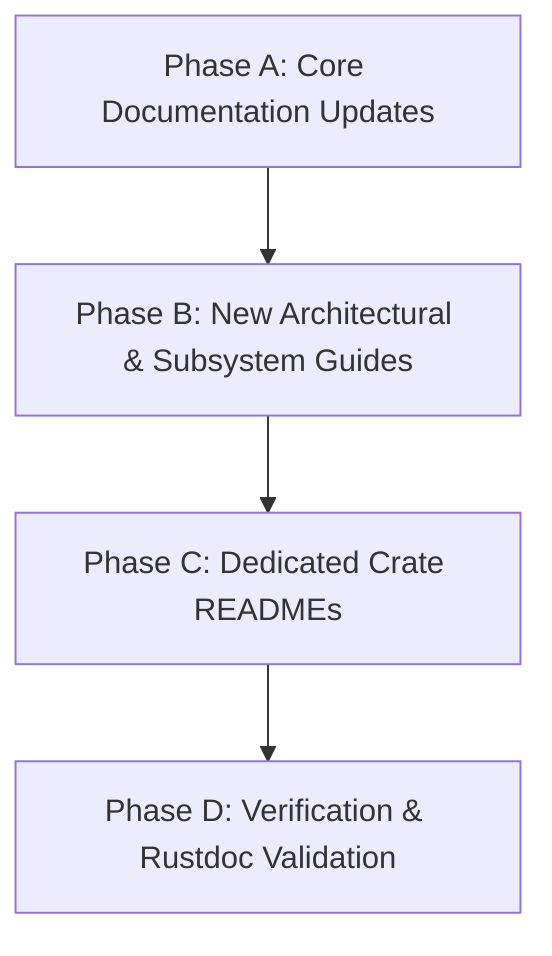

# Comprehensive Documentation Plan: YouTube Client Suite (v0.2.0)

**Target Workspace:** `youtube-client` (`youtube-client-lib`, `youtube-gui`, `youtube-client`, `youtube-installer`)  
**Target Version:** 0.2.0  
**Status:** Approved for Execution  
**Author:** AI Pair Programmer / Antigravity  

---

## 1. Executive Summary & Purpose

Over recent iterations, the `youtube-client` workspace underwent significant architectural evolution:
1. **SOLID Architectural Transformation (Phases 1–5):**
   - **Phase 1 (DIP & LSP):** `YoutubeApiService` composite trait, `YoutubeBackend` adapter (Live vs Mock), mock backend injection in GUI & CLI.
   - **Phase 2 (OCP):** Pluggable `MediaPlayer` trait, `PlayOptions`, `PlayerRegistry` auto-discovery (MPV, VLC, IINA, Custom, System).
   - **Phase 3 (OCP / Strategy Pattern):** `SubscriptionFormat` trait, `SubscriptionFormatRegistry` auto-detection (OPML, Google Takeout CSV, NewPipe JSON).
   - **Phase 4 (SRP & ISP):** Decoupled GUI domain action handlers (`youtube-gui/src/handlers/`: `auth`, `navigation`, `playback`, `download`, `settings`, `library`) and `VideoDetailsContext`.
   - **Phase 5 (SRP & OCP):** Decoupled CLI `OutputFormatter<T>` engine (`JsonFormatter`, `CsvFormatter`, `TableFormatter`) and pure `format_table` utility.
2. **Product Polish & Feature Enhancements (v0.2.0):**
   - Centralized OS AppData paths (`%APPDATA%/youtube-client` / `~/.config/youtube-client`).
   - Native GUI Settings view (player selector, download folder picker, browser cookie extraction, and one-click account disconnection).
   - Return YouTube Dislike (RYD) API integration and metrics display.
   - Interactive Rodio audio scrubber, elapsed/total duration readout, and 10s skip controls (`⏪ 10s`, `⏩ 10s`).
   - Persistent window geometry (pos, size, maximized) with debounce saving and restoration.
   - Persistent watch progress tracking (`playback_positions.json`) and one-click `▶ Resume` playback across feed cards and video details.
   - YouTube Data API v3 Quota Budget tracking (`api_quota.json`) with daily UTC rollover and real-time visual gauge card in GUI Settings.
   - Zero-quota public channel RSS Atom feed fallback.
   - In-memory metadata & channel cache with TTL (`TtlCache`, `MetadataCache`).
   - Inno Setup Windows installer (`dist/windows/setup.iss` -> `youtube-client-setup-0.2.0.exe`) and GitHub Actions release automation.

The current documentation set in `docs/` and root `README.md` was authored against v0.1.2/v0.1.3 and does not describe these capabilities, resulting in documentation drift. This document outlines a concrete, systematic plan to update existing documents and introduce missing guides and crate-level documentation.

---

## 2. Forensic Documentation Audit & Gap Analysis

| Document Path | Current Focus | Gaps & Outdated Information | Priority |
| :--- | :--- | :--- | :---: |
| **`README.md`** | High-level workspace overview (v0.1.3) | Outdated version tags; lacks mention of SOLID architecture, pluggable players, subscription import formats, RYD dislike metrics, window/playback persistence, quota management, and Windows installer. | **High** |
| **`docs/architecture.md`** | System topology & 10 quality attributes | Outdated component diagram; does not document `YoutubeBackend`, `MediaPlayer`, `SubscriptionFormat`, GUI domain action handlers, `OutputFormatter`, or caching/quota engines. | **High** |
| **`docs/gui_user_guide.md`** | View tours & controls | Missing the **Settings** view, interactive audio scrubber & skip controls, `Watched to MM:SS` badges, `▶ Resume` playback controls, RYD dislike counts, real-time download progress bars, and OPML/CSV import/export. | **High** |
| **`docs/cli_reference.md`** | 16 subcommands & JSON flags | Missing documentation for the decoupled `OutputFormatter` engine, CSV formatting capability, and mock backend integration for automated testing. | **Medium** |
| **`docs/configuration.md`** | Configuration resolution & schemas | Schema is missing `window_pos`, `window_size`, `window_maximized`, and new persistent files: `api_quota.json`, `playback_positions.json`. Lacks dynamic saving via GUI. | **High** |
| **`docs/video_playback.md`** | MPV & VLC setup | Relies on outdated hardcoded string matching. Needs to document `MediaPlayer` trait, `PlayerRegistry`, start offset propagation (`--start`, `--start-time`), and resume playback. | **High** |
| **`docs/installation_and_packaging.md`** | `youtube-installer` usage | Missing documentation for Inno Setup Windows installer (`setup.iss`) and multi-platform GitHub Actions release automation (`.github/workflows/release.yml`). | **Medium** |
| **`docs/development_and_testing.md`** | Testing & building | Test count is outdated (was 57, now 67); lacks guidelines on mock backend testing (`with_mock`), zero-warning Clippy enforcement, and SOLID contribution guidelines. | **Medium** |
| **Crate `README.md` Files** | Currently point to `../README.md` | Crates.io packages and crate directories lack dedicated, focused `README.md` files for `youtube-client-lib`, `youtube-gui`, `youtube-client`, and `youtube-installer`. | **High** |

---

## 3. Concrete Action Plan: Existing Document Modifications

### 3.1 Update `README.md`
- **Version Badges & Metadata:** Update badges to `0.2.0`, update dependency version references.
- **Architecture Highlights:** Introduce the 5 SOLID design phases (pluggable players, multi-format importers, decoupled handlers, and output formatters).
- **Features Showcase:**
  - Add **Native Settings & Account Disconnection**.
  - Add **Return YouTube Dislike (RYD)** community metrics.
  - Add **Interactive Audio Scrubber & Resume Playback**.
  - Add **API Quota Budget Tracking & Zero-Quota RSS Fallback**.
  - Add **Windows Single-File Setup Installer**.
- **Updated Documentation Table:** Link new guides (`solid_architecture.md`, `caching_and_quota.md`).

### 3.2 Update `docs/architecture.md`
- **Component Topology Diagram:** Update Mermaid diagram to reflect:
  - `YoutubeBackend` (Live `YoutubeClient` vs `MockYoutubeClient`).
  - `PlayerRegistry` & `MediaPlayer` implementations.
  - `SubscriptionFormatRegistry` & `SubscriptionFormat` strategies.
  - Decomposed GUI handlers (`handlers/auth`, `handlers/playback`, etc.).
  - `OutputFormatter<T>` presentation layer.
  - `TtlCache` & `QuotaTracker` subsystems.
- **SOLID Compliance Section:** Provide detailed architectural rationale for each of the 5 SOLID principles as applied to the workspace.

### 3.3 Update `docs/gui_user_guide.md`
- **New Section: Settings View:** Document graphical settings management:
  - Preferred media player selection (Auto, MPV, VLC, Custom executable).
  - Download destination folder selector.
  - Browser cookie extraction selection (`chrome`, `firefox`, `edge`, `brave`).
  - Active application file path inspection.
  - "Sign Out & Disconnect Account" safe token purge.
  - "Export Subscriptions to OPML" & "Import Subscriptions (OPML / CSV / JSON)".
- **Audio Dock Updates:** Document the interactive timeline scrubber slider, 10s skip buttons (`⏪ 10s`, `⏩ 10s`), and elapsed/total duration readout.
- **Playback Resume:** Document watched badges (`⏱ Watched to MM:SS`) and `▶ Resume` buttons in feeds and video details.
- **Engagement Updates:** Document RYD dislike display and tooltips.
- **Download Updates:** Document real-time percentage progress bar rendering.

### 3.4 Update `docs/configuration.md`
- **Updated JSON Schema:** Add `window_pos`, `window_size`, `window_maximized`.
- **Runtime Persistence Catalog:**
  - `config.json`: Dynamic configuration saved via Settings view or window state.
  - `tokencache.json`: OAuth token storage with OS security permissions (`0600` on Unix).
  - `api_quota.json`: Daily YouTube Data API v3 consumption tracker with daily UTC rollover.
  - `playback_positions.json`: Watched video timestamps and durations.
  - `cleared_videos.json`: Dismissed video feed hashes.
  - `youtube-client.log`: Centralized subprocess, media player, and diagnostic log.

### 3.5 Update `docs/video_playback.md`
- **Pluggable Media Player Registry:** Document `PlayerRegistry` auto-discovery order (`CustomExecutable` -> `MPV` -> `VLC` -> `IINA` -> `SystemDefault`).
- **Start Offset & Resume:** Explain how watched timestamps in `playback_positions.json` are passed to external players (`--start <seconds>` for MPV, `--start-time=<seconds>` for VLC).
- **Embedded Audio Engine:** Document Rodio worker capabilities, seek/skip commands, and playback synchronization.

### 3.6 Update `docs/installation_and_packaging.md`
- **Inno Setup Windows Installer:** Document compiling and running `dist/windows/setup.iss` to produce `youtube-client-setup-0.2.0.exe`.
- **GitHub Actions Release Automation:** Document `.github/workflows/release.yml`, automated compilation matrix, SHA256 checksum generation, and GitHub release attachments.

### 3.7 Update `docs/development_and_testing.md`
- **Updated Test Suites:** Reflect the 67 unit and integration tests across all crates.
- **Mock Testing Guidelines:** Document how to test CLI and GUI components using `CliContext::with_mock` and `AppState::with_mock_backend`.
- **Lint & Hygiene Standards:** Document mandatory `-D warnings` on Clippy and `cargo fmt --all -- --check`.

---

## 4. Concrete Action Plan: New Documents to Create

### 4.1 `docs/solid_architecture.md` (New Document)
- **Goal:** Comprehensive developer reference explaining the 5-phase SOLID refactoring.
- **Contents:**
  1. *Architectural Vision & Clean Design Principles.*
  2. *Phase 1: Dependency Inversion & Backend Abstraction (`YoutubeApiService`, `YoutubeBackend`).*
  3. *Phase 2: Open/Closed Media Players (`MediaPlayer`, `PlayOptions`, `PlayerRegistry`).*
  4. *Phase 3: Subscription Import/Export Strategy Pattern (`SubscriptionFormat`, `SubscriptionFormatRegistry`).*
  5. *Phase 4: GUI Domain Handlers & Interface Segregation (`youtube-gui/src/handlers/`, `VideoDetailsContext`).*
  6. *Phase 5: CLI Output Formatting Decoupling (`OutputFormatter<T>`, `JsonFormatter`, `CsvFormatter`, `TableFormatter`).*
  7. *Developer Extension Recipes:* Step-by-step guides on how to add a new media player, import format, or CLI output formatter.

### 4.2 `docs/caching_and_quota.md` (New Document)
- **Goal:** Complete guide to quota management and offline/caching resiliency.
- **Contents:**
  1. *YouTube Data API v3 Quota Economics (Searches: 100u, Reads: 1u, Writes: 50u).*
  2. *`QuotaTracker` Architecture, UTC Daily Reset, and Persistence.*
  3. *In-Memory `MetadataCache` and `TtlCache<K, V>` Mechanics.*
  4. *Zero-Quota Public Channel RSS Atom Feed Parsing & Fallback.*
  5. *Real-Time GUI Quota Gauge & Warning Thresholds.*

### 4.3 Crate-Level README Files (New Documents)
1. **[`youtube-client-lib/README.md`](file:///c:/Projects/youtube-client/youtube-client-lib/README.md)**:
   - Library overview, cargo features (`audio`, `download`), quickstart snippet, service traits, models, and mock testing.
2. **[`youtube-gui/README.md`](file:///c:/Projects/youtube-client/youtube-gui/README.md)**:
   - Native GUI overview, UI architecture, key views, audio dock, configuration, and launch options.
3. **[`youtube-client/README.md`](file:///c:/Projects/youtube-client/youtube-client/README.md)**:
   - CLI overview, installation, subcommand reference table, JSON piping recipes (`jq`), and shell completions.
4. **[`youtube-installer/README.md`](file:///c:/Projects/youtube-client/youtube-installer/README.md)**:
   - Installer overview, interactive setup, automated deployment (`--yes`), health check (`--verify`), and uninstallation.

---

## 5. Execution Roadmap & Verification

```mermaid
graph TD
    A[Phase A: Core Documentation Updates] --> B[Phase B: New Architectural & Subsystem Guides]
    B --> C[Phase C: Dedicated Crate READMEs]
    C --> D[Phase D: Verification & Rustdoc Validation]
```

### Phase A: Existing Document Updates
- Edit `README.md`
- Edit `docs/architecture.md`
- Edit `docs/gui_user_guide.md`
- Edit `docs/configuration.md`
- Edit `docs/video_playback.md`
- Edit `docs/installation_and_packaging.md`
- Edit `docs/development_and_testing.md`

### Phase B: New Specialized Guides
- Write `docs/solid_architecture.md`
- Write `docs/caching_and_quota.md`

### Phase C: Crate-Level READMEs
- Write `youtube-client-lib/README.md`
- Write `youtube-gui/README.md`
- Write `youtube-client/README.md`
- Write `youtube-installer/README.md`
- Update crate `Cargo.toml` files to reference local `README.md` instead of `../README.md`.

### Phase D: Quality Assurance & Validation
1. **Broken Link Check:** Verify all relative markdown links (`[text](docs/...)`, `[text](../...)`) point to existing files and valid anchors.
2. **Code Snippet Accuracy:** Verify all rust, bash, and json snippets in documentation reflect actual code signatures and schemas.
3. **Rustdoc Build Check:** Run `cargo doc --workspace --no-deps` to verify documentation builds without warnings.
4. **Git Commit:** Stage and commit documentation updates with descriptive semantic commit messages.
