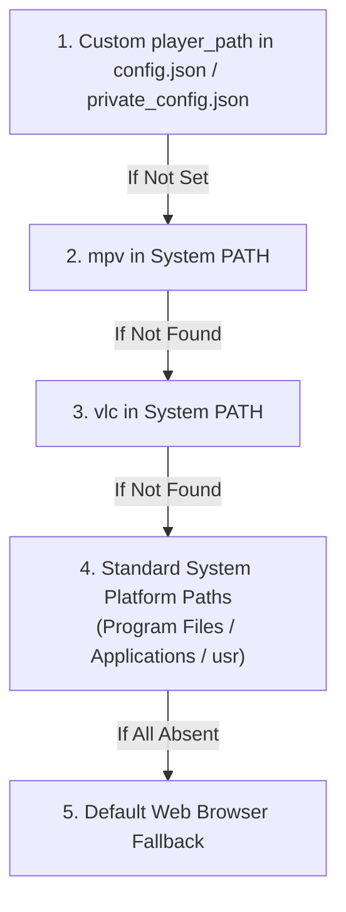

# Video & Audio Playback Configuration Guide

The YouTube Client suite provides multiple avenues for consuming media:
1. **Direct Video Streaming:** Stream online YouTube videos via desktop media players (**MPV** or **VLC**) with browser fallback.
2. **Integrated Desktop Audio Player:** Listen to background audio tracks directly within `youtube-gui` using the built-in **Rodio** audio dock.
3. **Command-Line Playback:** Play downloaded audio/video files locally using `youtube-client play`.
4. **Media Downloads:** Extract MP4 video or MP3 audio streams via `yt-dlp` using `youtube-client download`.

---

## 1. Direct Video Streaming Setup

When clicking a video card in `youtube-gui`, the application searches for an external media player in the following priority order:



### Option A: MPV (Recommended)
MPV is the recommended streaming player due to its lightweight footprint and fast buffering.

1. **Install MPV:**
   * **Windows:** Download from [mpv.io](https://mpv.io/) or install via Scoop/Chocolatey (`scoop install mpv`).
   * **macOS:** Install via Homebrew: `brew install mpv`.
   * **Linux:** Install via package manager: `sudo apt install mpv` or `sudo dnf install mpv`.
2. **Install `yt-dlp`:**
   * MPV uses `yt-dlp` under the hood to resolve YouTube video streams.
   * Download the latest binary from [yt-dlp GitHub releases](https://github.com/yt-dlp/yt-dlp) and ensure it is in your system `PATH`.

> [!IMPORTANT]
> **HTTP 403 Forbidden & YouTube Bot Verification:**
> YouTube continuously updates server-side stream protection, which causes older versions of `yt-dlp` (such as `2026.07.04` and earlier) to hit `HTTP error 403 Forbidden` on `c=ANDROID_VR` or bot challenges when MPV streams video chunks.
> 1. **Update yt-dlp:** Run `yt-dlp -U` (or `yt-dlp --update-to nightly`). Updating to `2026.08.19` or later resolves the `googlevideo.com` 403 Forbidden streaming error.
> 2. **Watch in Browser:** Click the **"🌐 Watch in Browser"** button in `youtube-gui` for instant playback in your authenticated web browser.
> 3. **Browser Cookies:** Set `"cookies_from_browser": "firefox"` (or `chrome`, `edge`, `brave`) or `"cookies_file": "path/to/cookies.txt"` in `config.json` / `private_config.json` (or via `--cookies` / `--cookies-from-browser`). `youtube-gui` passes these automatically to MPV and `yt-dlp`.

### Option B: VLC Media Player
1. Download and install VLC from [VideoLAN](https://www.videolan.org/).
2. If VLC fails to play YouTube URLs, update the VLC YouTube playlist parser:
   * Download the latest `youtube.luac` from the [VLC Git Repository](https://code.videolan.org/videolan/vlc/-/raw/master/share/lua/playlist/youtube.lua).
   * Place it into your VLC lua playlist directory (e.g. `C:\Program Files\VideoLAN\VLC\lua\playlist\youtube.luac`), replacing the outdated version.

---

## 2. Configuring Custom Media Player Paths

If your media player is installed in a non-standard location, define `player_path` in `private_config.json` (or `config.json`):

### Windows Example
```json
{
  "player_path": "C:\\Program Files\\mpv\\mpv.exe"
}
```

### Linux Example
```json
{
  "player_path": "/usr/bin/mpv"
}
```

### macOS Example
```json
{
  "player_path": "/Applications/VLC.app/Contents/MacOS/VLC"
}
```

---

## 3. Integrated Audio Player (`rodio`)

`youtube-gui` includes a native hardware-accelerated audio engine built on `rodio`:

* **Hardware Decoding:** Runs on a dedicated background thread, decoupled from the 60 FPS egui rendering loop.
* **Volume Slider:** Adjust output level dynamically from `0%` to `100%`.
* **Instant Mute:** One-click mute toggle that remembers your previous volume setting.
* **Zero External Dependencies:** Plays supported audio formats without requiring MPV or VLC.

---

## 4. Command-Line Playback & Media Downloading

### Play Local Media via CLI
To play downloaded media files using `youtube-client`:

```bash
# Play audio locally using Rodio
youtube-client play --file downloads/song.mp3

# Open using the operating system's default media player
youtube-client play --file downloads/video.mp4 --system
```

### Download Media with Format Selection
To download streams directly to disk:

```bash
# Download best MP4 video
youtube-client download --video-id dQw4w9WgXcQ --format mp4

# Download and extract MP3 audio
youtube-client download --video-id dQw4w9WgXcQ --format mp3 --output downloads/rick.mp3

# Constrain video resolution
youtube-client download --video-id dQw4w9WgXcQ --quality 1080p
```

For full CLI options, see the [CLI Reference Manual](cli_reference.md).
