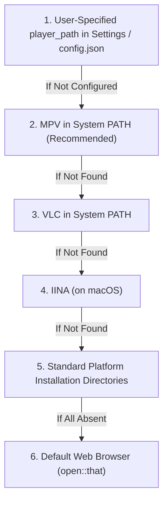

# Video & Audio Playback Architecture Guide (v0.2.0)

The YouTube Client suite provides multiple avenues for consuming media:
1. **Direct Video Streaming:** Stream online YouTube videos via desktop media players (**MPV**, **VLC**, **IINA**, or custom binaries) with browser fallback.
2. **Integrated Desktop Audio Engine:** Listen to background audio tracks directly within `youtube-gui` using the built-in **Rodio** audio dock with interactive timeline scrubber and skip controls.
3. **Command-Line Playback:** Play downloaded audio/video files locally using `youtube-client play`.
4. **Media Downloads:** Extract MP4 video or MP3 audio streams via `yt-dlp` using `youtube-client download`.

---

## 1. Pluggable Media Player Architecture (`MediaPlayer` & `PlayerRegistry`)

Rather than relying on hardcoded process invocations, external player dispatching is governed by the Open/Closed Principle via the [`MediaPlayer`](file:///c:/Projects/youtube-client/youtube-client-lib/src/player.rs) trait:

```rust
pub struct PlayOptions {
    pub start_secs: Option<f32>,
    pub cookies_file: Option<PathBuf>,
    pub user_agent: Option<String>,
    pub log_file: Option<PathBuf>,
}

pub trait MediaPlayer: Send + Sync {
    fn id(&self) -> &'static str;
    fn display_name(&self) -> &'static str;
    fn is_available(&self) -> bool;
    fn launch_stream(&self, url: &str, title: &str, opts: &PlayOptions) -> Result<std::process::Child, String>;
    fn launch_file(&self, path: &Path, title: &str, opts: &PlayOptions) -> Result<std::process::Child, String>;
}
```

### Supported Media Players

| Player | Identifier | Availability Check | Start Offset Flag | Cookies Flag |
| :--- | :--- | :--- | :--- | :--- |
| **MPV** | `mpv` | `mpv` in system `PATH` | `--start=<secs>` | `--ytdl-raw-options=cookies=...` |
| **VLC** | `vlc` | `vlc` in system `PATH` | `--start-time=<secs>` | `--meta-title` |
| **IINA** | `iina` | `iina-cli` or `/Applications/IINA.app` | `--mpv-start=<secs>` | Forwarded to mpv engine |
| **Custom** | `custom` | Verified executable path | User-configured | Forwarded |
| **System** | `system` | Default OS file association | N/A | Default browser handler |

### Player Discovery Hierarchy

When streaming a video, [`PlayerRegistry`](file:///c:/Projects/youtube-client/youtube-client-lib/src/player.rs) selects a player according to:


```mermaid
graph TD
    P1["1. User-Specified player_path in Settings / config.json"] -->|If Not Configured| P2["2. MPV in System PATH (Recommended)"]
    P2 -->|If Not Found| P3["3. VLC in System PATH"]
    P3 -->|If Not Found| P4["4. IINA (on macOS)"]
    P4 -->|If Not Found| P5["5. Standard Platform Installation Directories"]
    P5 -->|If All Absent| P6["6. Default Web Browser (open::that)"]
```

---

## 2. Watch Progress Tracking & Resume Playback

`youtube-gui` continuously tracks playback progress to ensure seamless resumption:
1. **Timestamp Persistence:** Every 200ms of playback, the current position (`position_secs`, `duration_secs`) is synchronized and written atomically to `%APPDATA%/youtube-client/playback_positions.json` (or `~/.config/youtube-client/playback_positions.json`).
2. **Resume Badges:** Feeds and details views display a red progress line under thumbnails and a `⏱ Watched to MM:SS` badge.
3. **Offset Forwarding:**
   - **Internal Audio:** Starts decoding directly from the saved offset.
   - **MPV:** Launches with `--start <seconds>`.
   - **VLC:** Launches with `--start-time=<seconds>`.
4. **Auto-Cleanup:** Upon reaching 95% completion or video end, the resume marker is automatically purged.

---

## 3. Configuring Cookies & Bypassing Bot Verification

YouTube frequently introduces server-side stream protection causing older versions of `yt-dlp` to hit `HTTP 403 Forbidden` on MPV video streams.

### Solution 1: Update yt-dlp
Run:
```bash
yt-dlp -U
```
Updating `yt-dlp` resolves most `googlevideo.com` 403 Forbidden issues.

### Solution 2: Browser Cookie Extraction (Recommended)
Configure your browser in the **Settings** view in `youtube-gui` or define `"cookies_from_browser"` in `config.json`:
```json
{
  "cookies_from_browser": "firefox"
}
```
Supported values: `chrome`, `firefox`, `edge`, `brave`, `opera`, `vivaldi`. `PlayerRegistry` automatically extracts and forwards session cookies to `yt-dlp` and `mpv`.

### Solution 3: Watch in Browser Fallback
Click **"🌐 Watch in Browser"** on any video card to immediately open the stream in your authenticated web browser.

---

## 4. Integrated Desktop Audio Engine (`rodio`)

`youtube-gui` features a native hardware-accelerated audio engine running on a dedicated thread:

* **Interactive Timeline Scrubber:** Drag the slider in the bottom audio dock to seek immediately to any point in the stream.
* **Skip Controls:** Dedicated `⏪ 10s` and `⏩ 10s` buttons for quick timeline navigation.
* **Elapsed / Total Duration:** Real-time timestamp readout (`MM:SS / MM:SS`).
* **Volume Slider & Mute:** Dynamic volume scaling from `0%` to `100%` with instantaneous mute/unmute memory.
* **Zero UI Stutter:** Audio decoding is decoupled from the main egui rendering thread, guaranteeing smooth 60 FPS UI interaction during playback.

---

## 5. Command-Line Playback & Media Downloading

### Play Local Media via CLI
```bash
# Play audio locally using Rodio
youtube-client play --file downloads/song.mp3

# Open using the operating system's default media player
youtube-client play --file downloads/video.mp4 --system
```

### Download Media with Format Selection
```bash
# Download best MP4 video
youtube-client download --video-id dQw4w9WgXcQ --format mp4

# Download and extract MP3 audio
youtube-client download --video-id dQw4w9WgXcQ --format mp3 --output downloads/rick.mp3

# Constrain video resolution
youtube-client download --video-id dQw4w9WgXcQ --quality 1080p
```
