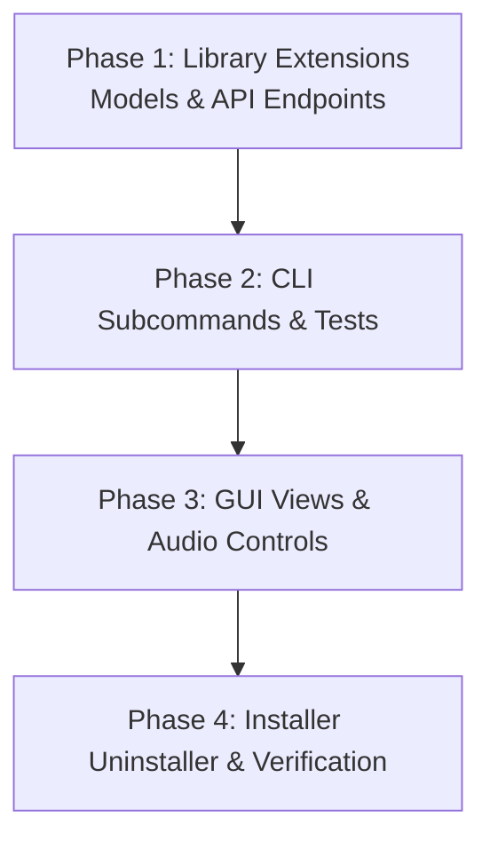

# YouTube Client Workspace: Concrete Missing Features Refactor Plan

> **Scope:** Entire workspace (`youtube-client-lib`, `youtube-client`, `youtube-gui`, `youtube-installer`).  
> **Objective:** Identify, design, and architect all missing YouTube Data API v3 and client features across the library, CLI, GUI, and installer to achieve feature completeness and maximum utility.  
> **Documentation Reference:** For user and technical manuals covering these implemented features, see [`docs/cli_reference.md`](../docs/cli_reference.md) and [`docs/gui_user_guide.md`](../docs/gui_user_guide.md).

---

## 1. Feature Gap Analysis Matrix

| Feature Area | Current State | Missing Functionality | Target Component(s) |
| :--- | :--- | :--- | :--- |
| **Video Details & Metrics** | Only basic snippet fields (`id`, `title`, `description`, `published_at`). | View count, like count, comment count, ISO duration, tags, category. | `youtube-client-lib`, `youtube-client`, `youtube-gui` |
| **Channel Statistics & Profiles** | Only channel uploads playlist resolution exists. | Subscriber count, total video count, channel banner, custom handle (`@username`). | `youtube-client-lib`, `youtube-client`, `youtube-gui` |
| **Comment Interaction** | Read-only comment thread fetching (`fetch_comments`). | Post top-level comment (`insert`), reply to comment thread, delete comment. | `youtube-client-lib`, `youtube-client`, `youtube-gui` |
| **Playlist Lifecycle** | Only `list_playlists`, `create_playlist`, and `add_to_playlist`. | Delete playlist (`delete`), remove item from playlist (`playlistItems.delete`), update title/description. | `youtube-client-lib`, `youtube-client`, `youtube-gui` |
| **Subscription Lifecycle** | `list_subscriptions` and `subscribe_to_channel`. | Interactive channel search/filter in GUI, unsubscribe from subscription card. | `youtube-client`, `youtube-gui` |
| **Audio Playback Ergonomics** | Basic play/pause/stop via Rodio. | Volume control slider (0-100%), mute toggle, playback progress/duration tracking. | `youtube-client-lib`, `youtube-gui` |
| **CLI Command Coverage** | Subscriptions, videos, search, rate, playlists, download, play. | `details`, `channel`, `comments`, `comment-post`, `subscribe`, `unsubscribe`, `playlist-create`, `playlist-delete`. | `youtube-client` |
| **Installer & Lifecycle** | Install-only mode. | Clean uninstallation (`--uninstall`), health check verification (`--verify`). | `youtube-installer` |

---

## 2. Detailed Technical Architecture & Specification

---

### Component 1: Core Library (`youtube-client-lib`)

#### 1.1 Video Details & Statistics Model
Add `VideoDetails` struct in `youtube-client-lib/src/models/video_details.rs`:
```rust
#[derive(Clone, Debug, serde::Serialize, serde::Deserialize)]
pub struct VideoDetails {
    pub id: String,
    pub title: String,
    pub description: String,
    pub published_at: String,
    pub channel_id: String,
    pub channel_title: String,
    pub thumbnail_url: String,
    pub view_count: u64,
    pub like_count: u64,
    pub comment_count: u64,
    pub duration_seconds: u64,
    pub tags: Vec<String>,
}
```
Method on `YoutubeClient`:
```rust
pub async fn fetch_video_details(&self, video_id: &str) -> Result<VideoDetails>;
```
Implementation queries `hub.videos().list(&["snippet", "statistics", "contentDetails"]).add_id(video_id).doit()`.

#### 1.2 Channel Details & Statistics Model
Add `ChannelDetails` struct in `youtube-client-lib/src/models/channel_details.rs`:
```rust
#[derive(Clone, Debug, serde::Serialize, serde::Deserialize)]
pub struct ChannelDetails {
    pub id: String,
    pub title: String,
    pub description: String,
    pub custom_url: Option<String>,
    pub thumbnail_url: String,
    pub subscriber_count: u64,
    pub video_count: u64,
    pub view_count: u64,
}
```
Method on `YoutubeClient`:
```rust
pub async fn get_channel_details(&self, channel_id: &str) -> Result<ChannelDetails>;
```

#### 1.3 Comment Creation
Method on `YoutubeClient`:
```rust
pub async fn post_comment(&self, video_id: &str, text: &str) -> Result<Comment>;
```
Implementation builds `CommentThread` with `CommentThreadSnippet` and calls `hub.comment_threads().insert(thread).doit()`.

#### 1.4 Playlist Deletion
Method on `YoutubeClient`:
```rust
pub async fn delete_playlist(&self, playlist_id: &str) -> Result<()>;
```
Calls `hub.playlists().delete(playlist_id).doit()`.

#### 1.5 Audio Playback Volume Control
In `youtube-client-lib/src/audio.rs`:
Add `set_volume(volume: f32)` support to the Rodio sink abstraction.

---

### Component 2: Command-Line Interface (`youtube-client`)

#### 2.1 Subcommand Additions in `youtube-client/src/lib.rs`:
1. `Details`:
   ```rust
   Details {
       #[arg(short, long)]
       video_id: String,
       #[arg(long)]
       json: bool,
   }
   ```
2. `Channel`:
   ```rust
   Channel {
       #[arg(short, long)]
       channel_id: String,
       #[arg(long)]
       json: bool,
   }
   ```
3. `Comments`:
   ```rust
   Comments {
       #[arg(short, long)]
       video_id: String,
       #[arg(short, long, default_value_t = 20)]
       limit: u32,
       #[arg(long)]
       json: bool,
   }
   ```
4. `CommentPost`:
   ```rust
   CommentPost {
       #[arg(short, long)]
       video_id: String,
       #[arg(short, long)]
       text: String,
   }
   ```
5. `Subscribe`:
   ```rust
   Subscribe {
       #[arg(short, long)]
       channel_id: String,
   }
   ```
6. `Unsubscribe`:
   ```rust
   Unsubscribe {
       #[arg(short, long)]
       subscription_id: String,
   }
   ```
7. `PlaylistCreate`:
   ```rust
   PlaylistCreate {
       #[arg(short, long)]
       title: String,
       #[arg(short, long)]
       description: Option<String>,
   }
   ```
8. `PlaylistDelete`:
   ```rust
   PlaylistDelete {
       #[arg(short, long)]
       playlist_id: String,
   }
   ```

---

### Component 3: Desktop GUI (`youtube-gui`)

#### 3.1 Enhanced `details_view.rs`
- **Video Statistics Bar:** Display cards for Views (`👁 1.2M views`), Likes (`👍 45K likes`), Comments count (`💬 3.4K comments`), and parsed Duration (`⏱ 14:22`).
- **Interactive Comment Form:** Text edit input with a "💬 Post Comment" button that dispatches `PendingAction::PostComment`.
- **Channel Header & Navigation:** Clickable channel badge navigating to `View::ChannelVideos { channel_id }`.

#### 3.2 Enhanced `playlists_view.rs`
- **Create Playlist Dialog:** Collapsible panel with `Title` and `Description` input fields and a "Create Playlist" button dispatching `PendingAction::CreatePlaylist`.
- **Delete Playlist Action:** A "🗑 Delete" button on each playlist card with confirmation prompt.

#### 3.3 Audio Player Volume & Mute in `main.rs`
- In `audio_player` panel: Add a volume slider `ui.add(egui::Slider::new(&mut self.volume, 0.0..=1.0).text("🔊 Volume"))`.
- Mute button toggling between `0.0` and previous volume.

#### 3.4 Filterable Subscriptions in `subscriptions_view.rs`
- Filter text field at the top of the subscriptions list, dynamically filtering subscriptions matching the typed channel title in real time.

---

### Component 4: System Installer (`youtube-installer`)

#### 4.1 Uninstallation Support (`--uninstall`)
- Locate installed binaries in installation directory (`%LOCALAPPDATA%\Programs\YouTubeClient` on Windows or `/usr/local/bin` on Linux).
- Remove desktop shortcuts and remove installation directory from system `PATH`.
- Print clean confirmation.

#### 4.2 Health Verification (`--verify`)
- Test execution of installed `youtube-client --help` and `youtube-gui --version`.
- Report status with checkmarks.

---

## 3. Step-by-Step Implementation Roadmap



### Phase 1: Library Models & API Methods (`youtube-client-lib`)
- [ ] Add `VideoDetails` model with statistics parsing.
- [ ] Add `ChannelDetails` model with subscriber metrics.
- [ ] Implement `fetch_video_details(&self, video_id)` in `client.rs`.
- [ ] Implement `get_channel_details(&self, channel_id)` in `client.rs`.
- [ ] Implement `post_comment(&self, video_id, text)` in `client.rs`.
- [ ] Implement `delete_playlist(&self, playlist_id)` in `client.rs`.
- [ ] Update `VideoService`, `ChannelService`, `PlaylistService`, and `CommentService` traits.
- [ ] Update `MockYoutubeClient` with new methods.

### Phase 2: CLI Command Expansion (`youtube-client`)
- [ ] Add `Details`, `Channel`, `Comments`, `CommentPost`, `Subscribe`, `Unsubscribe`, `PlaylistCreate`, `PlaylistDelete` subcommands to `youtube-client`.
- [ ] Implement corresponding execution functions in `youtube-client/src/commands/`.
- [ ] Add integration tests in `youtube-client/tests/cli_tests.rs` for all new subcommands.

### Phase 3: GUI View Upgrades (`youtube-gui`)
- [ ] Add `VideoDetails` query and display statistics badges in `details_view.rs`.
- [ ] Add comment submission text box and post button in `details_view.rs`.
- [ ] Add channel link navigation in `details_view.rs`.
- [ ] Add playlist creation inputs and delete button in `playlists_view.rs`.
- [ ] Add channel title search filter in `subscriptions_view.rs`.
- [ ] Add audio volume slider in bottom player panel in `main.rs`.

### Phase 4: Installer Upgrades (`youtube-installer`)
- [ ] Implement `--uninstall` flag removing binaries and shortcuts.
- [ ] Implement `--verify` flag testing installed binaries.

---

## 4. Verification Plan

1. **Unit & Integration Tests:**
   ```bash
   cargo test --workspace
   ```
2. **CLI Commands Smoke Test:**
   ```bash
   cargo run --bin youtube-client -- details --help
   cargo run --bin youtube-client -- comments --help
   cargo run --bin youtube-client -- channel --help
   cargo run --bin youtube-client -- subscribe --help
   cargo run --bin youtube-client -- playlist-create --help
   ```
3. **Compiler and Rustdoc Validation:**
   ```bash
   cargo check --workspace --all-targets
   cargo doc --workspace --no-deps
   ```
