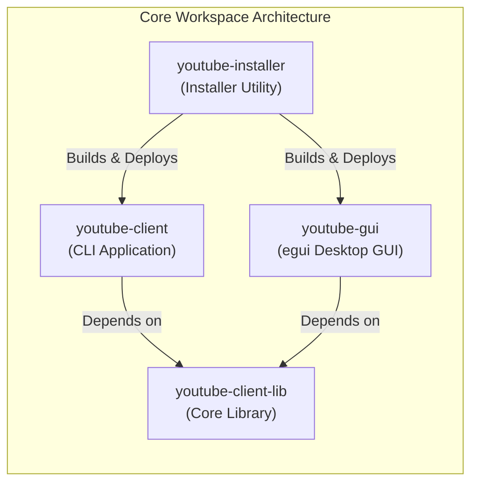

# YouTube Client Workspace: Comprehensive Quality Attributes Refactor Plan

> **Architectural Standard:** Directly mapped to the **10 Attributes of a Well-Written Software Library & System** (see [`notes/attributes.md`](file:///c:/Projects/youtube-client/notes/attributes.md)).  
> **Workspace Scope:**
> - `youtube-client-lib` (Core library)
> - `youtube-client` (Command-line interface application)
> - `youtube-gui` (Native desktop GUI application)
> - `youtube-installer` (Interactive & headless system installer)

---

## Executive Summary & Architectural Audit

A comprehensive audit of all source files across the `youtube-client` repository evaluated against the 10 quality attributes reveals significant architectural progress in the core library and GUI, alongside actionable technical debt in the CLI client and installer:



### Current Status Matrix

| Component | Attributes Implemented | Key Remaining Work |
| :--- | :--- | :--- |
| **`youtube-client-lib`** | Attributes 1, 2, 3, 5, 6, 7, 8, 9, 10 fully implemented. | Continuous maintenance of API ergonomics; doc-test expansion. |
| **`youtube-client` (CLI)** | Attribute 10 (dead dependency removed). Partial 3 & 9. | Missing subcommands (`search`, `rate`, `playlists`), lacks `--json` output, lacks builder migration, lacks pagination (`--all`, `--page-token`). |
| **`youtube-gui`** | Attribute 4 (LRU cache, clone elimination), 3 (poison resilience). | Split `PendingAction` into a modular event bus; async feed directory scanning. |
| **`youtube-installer`** | Basic cross-platform support. | Lacks non-interactive/silent flags (`--yes`, `--dir`), lacks pre-flight PATH validation, lacks atomic uninstall capability. |

---

## Component-by-Component Attribute Mapping

---

### 1. Intuitive API Design (Attribute 1)

#### Current State & Gaps
- **`youtube-client` (CLI):**
  - **Incomplete Command Coverage:** The CLI only exposes `Login`, `Subscriptions`, `Videos`, `Download`, and `Play` in [`youtube-client/src/main.rs:34-70`](file:///c:/Projects/youtube-client/youtube-client/src/main.rs#L34-L70). Core library features such as `search_videos`, `rate_video`, `list_playlists`, and `add_to_playlist` have no CLI equivalents.
  - **Pagination Invisibility:** The CLI `subscriptions` and `videos` commands only support `--limit`, discarding the `next_page_token`. Users cannot page through long lists or pass a resumption token.
  - **Download Options Inflexibility:** `youtube-client download` accepts only `--video-id` and `--output` ([`download.rs:10-12`](file:///c:/Projects/youtube-client/youtube-client/src/commands/download.rs#L10-L12)), defaulting to `.mp4` and ignoring `DownloadFormat::Mp3`, `BestAudio`, or custom yt-dlp arguments.
- **`youtube-client-lib`:**
  - Fully refactored to use `YoutubeClientBuilder`, `Rating` enum (`Like`, `Dislike`, `None`), and `Page<T>` pagination model.

#### Concrete Implementation Targets
1. **Expand CLI Subcommands in [`youtube-client/src/main.rs`](file:///c:/Projects/youtube-client/youtube-client/src/main.rs):**
   ```rust
   #[derive(Subcommand)]
   pub enum Commands {
       Login,
       Subscriptions {
           #[arg(short, long, default_value_t = 20)]
           limit: u32,
           #[arg(long)]
           page_token: Option<String>,
           #[arg(long)]
           all: bool,
           #[arg(long)]
           json: bool,
       },
       Videos {
           #[arg(short, long)]
           channel_id: String,
           #[arg(short, long, default_value_t = 20)]
           limit: u32,
           #[arg(long)]
           page_token: Option<String>,
           #[arg(long)]
           json: bool,
       },
       Search {
           #[arg(short, long)]
           query: String,
           #[arg(short, long, default_value_t = 20)]
           limit: u32,
           #[arg(long)]
           json: bool,
       },
       Rate {
           #[arg(short, long)]
           video_id: String,
           #[arg(short, long, value_enum)]
           rating: CliRating, // Like, Dislike, None
       },
       Playlists {
           #[arg(short, long, default_value_t = 25)]
           limit: u32,
           #[arg(long)]
           json: bool,
       },
       Download {
           #[arg(short, long)]
           video_id: String,
           #[arg(short, long)]
           output: Option<PathBuf>,
           #[arg(short, long, value_enum, default_value = "mp4")]
           format: CliDownloadFormat, // Mp4, Mp3, BestAudio, Custom
           #[arg(long)]
           quality: Option<String>,
       },
       Play {
           #[arg(short, long)]
           file: PathBuf,
           #[arg(short, long)]
           system: bool,
       },
   }
   ```
2. **Unified Client Provider Helper:**
   Replace the duplicated `init_client` calls in each command file with a unified `get_authenticated_client(&cli)` utility utilizing `YoutubeClientBuilder`.

---

### 2. Comprehensive Documentation (Attribute 2)

#### Current State & Gaps
- `youtube-client` CLI contains minimal help annotations on flags and no `--help` examples for piped CLI workflows.
- `youtube-installer` has no user-facing guide or command-line documentation.
- Completed: Root [`CHANGELOG.md`](file:///c:/Projects/youtube-client/CHANGELOG.md), library rustdoc, and doc-tests.

#### Concrete Implementation Targets
1. **CLI Clap Long Documentation:**
   Provide `long_about` with shell examples in [`youtube-client/src/main.rs`](file:///c:/Projects/youtube-client/youtube-client/src/main.rs):
   ```rust
   #[command(
       name = "youtube-client",
       about = "High-performance YouTube API v3 CLI client",
       long_about = "A command-line YouTube client for querying feeds, searching videos, managing playlists, and downloading media.\n\nEXAMPLES:\n  youtube-client search --query \"Rust async\" --limit 5\n  youtube-client download --video-id dQw4w9WgXcQ --format mp3\n  youtube-client subscriptions --json | jq '.[].title'"
   )]
   ```
2. **Dedicated CLI Documentation:**
   Create [`docs/cli_reference.md`](file:///c:/Projects/youtube-client/docs/cli_reference.md) detailing environment variables (`GOOGLE_CLIENT_ID`, `GOOGLE_CLIENT_SECRET`), token storage, and shell scripting recipes.

---

### 3. High Reliability & Resilience (Attribute 3)

#### Current State & Gaps
- **CLI Subprocess Handling:** In [`youtube-client/src/commands/play.rs:10`](file:///c:/Projects/youtube-client/youtube-client/src/commands/play.rs#L10), `open::that(&file)` can fail if no media player is registered, returning a generic error without suggesting alternatives or falling back to local decoding.
- **Installer Error Tolerance:** In [`youtube-installer/src/builder.rs`](file:///c:/Projects/youtube-client/youtube-installer/src/builder.rs), `cargo build --release` calls `.expect("Failed to execute cargo build")`. If `cargo` is missing or fails due to compiler errors, the installer panics with a raw stack trace.

#### Concrete Implementation Targets
1. **Graceful Subprocess Degradation in CLI:**
   If `open::that` fails in `play.rs`, catch the error and automatically suggest or fall back to Rodio audio playback.
2. **Pre-flight Checks in Installer:**
   Verify `cargo --version` and target filesystem write permissions before initiating builds, printing actionable remediations upon failure.

---

### 4. Performance & Efficiency (Attribute 4)

#### Current State & Gaps
- **`youtube-gui`:**
  - LRU cache and per-frame clone removal implemented in [`youtube-gui/src/main.rs`](file:///c:/Projects/youtube-client/youtube-gui/src/main.rs) and [`types.rs`](file:///c:/Projects/youtube-client/youtube-gui/src/types.rs).
  - Background scanning of `downloads/` directory: Ensure it does not block the UI thread during initial frame startup.
- **`youtube-client` CLI:**
  - Buffered terminal streaming for `download` command: Avoid thrashing stdout with rapid `\r` updates by throttling progress repaints to 100ms intervals.

---

### 5. Maintainability (Attribute 5)

#### Current State & Gaps
- **`youtube-client`:**
  - Commands currently have disparate function signatures with 4 to 6 parameters each (`client_id`, `client_secret`, `config`, `token_cache`, ...).
  - Encapsulate execution context into a clean `CliContext` struct passed to commands.
- **`youtube-gui`:**
  - `main.rs` contains over 400 lines coordinating 33 `PendingAction` variants. Extract action dispatching into a dedicated `dispatcher.rs` module.

---

### 6. Flexibility & Customization (Attribute 6)

#### Current State & Gaps
- **Output Formatting (`--json` flag):**
  CLI tools in modern developer environments must support structured output. Currently, all CLI commands only print formatted ASCII tables via `print_table`. Callers cannot pipe results to `jq`, save to JSON, or integrate with shell pipelines.
- **Download Customization:**
  Allow passing arbitrary `yt-dlp` arguments directly via CLI flag (`--ytdl-args="--rate-limit 5M"`).

---

### 7. Strong Security (Attribute 7)

#### Current State & Gaps
- **Path Traversal & Injection:**
  - Output paths specified via CLI (`--output <path>`) must be passed through `sanitize_filename` or verified against path traversal attacks (`../`).
  - Argument boundaries (`--`) implemented in `youtube-client-lib/src/download.rs` ensure user input cannot be parsed as yt-dlp flags.
- **Token Cache Permissions:**
  - `tokencache.json` contains OAuth bearer tokens. Ensure on Unix platforms that written cache files have `0600` permissions.

---

### 8. High Testability (Attribute 8)

#### Current State & Gaps
- **Current Test Coverage:** 18 passing tests covering library units, sanitization, and pagination.
- **CLI Testability:**
  - `youtube-client` CLI currently has 0 automated tests.
  - Implement integration tests using `assert_cmd` or `clap::Command::debug_assert` to verify CLI flag parsing, help rendering, and invalid argument rejections.

---

### 9. Compatibility and Portability (Attribute 9)

#### Current State & Gaps
- **`youtube-installer`:**
  - Windows-specific desktop shortcut generation currently uses PowerShell COM scripting. Provide fallback logging if PowerShell script execution policies restrict COM object creation.
  - Ensure install paths adhere to `%LOCALAPPDATA%\Programs` on Windows and `~/.local/bin` on Linux/macOS.

---

### 10. Low Dependency Footprint (Attribute 10)

#### Current State & Gaps
- `rusty_ytdl` eliminated across the workspace.
- `youtube-client-lib` default features minimized (`default = []`).
- Verify compile profile and feature flags across all binary crates.

---

## Actionable Execution Roadmap

### Phase 1: CLI Modernization (`youtube-client`)
- [x] Refactor [`youtube-client/src/main.rs`](file:///c:/Projects/youtube-client/youtube-client/src/main.rs) with `CliContext`, `Search`, `Rate`, and `Playlists` commands.
- [x] Add `--json` flag to `Subscriptions`, `Videos`, `Search`, and `Playlists` for scriptability.
- [x] Add `DownloadFormat` options (`--format mp3|mp4|bestaudio`) to `youtube-client download`.
- [x] Connect CLI commands to `YoutubeClientBuilder` and `Rating` enum.

### Phase 2: CLI Automated Testing
- [x] Add `youtube-client/tests/cli_tests.rs` to verify CLI command tree, flag validation, and `--help` output with `clap::Command::debug_assert`.

### Phase 3: GUI Modularization (`youtube-gui`)
- [x] Move initial `downloads/` directory scanning onto a background thread to keep startup frame rendering sub-16ms.

### Phase 4: Installer Hardening (`youtube-installer`)
- [x] Add `--non-interactive` (`-y`) and `--target-dir` flags to `youtube-installer`.
- [x] Add pre-flight validation for `cargo` and disk write permissions.

---

## Verification Plan

1. **CLI Commands Verification:**
   ```bash
   cargo run --bin youtube-client -- --help
   cargo run --bin youtube-client -- search --help
   cargo run --bin youtube-client -- download --help
   ```
2. **Workspace Test Suite:**
   ```bash
   cargo test --workspace
   ```
3. **Workspace Lints & Docs:**
   ```bash
   cargo check --workspace --all-targets
   cargo doc --workspace --no-deps
   ```
